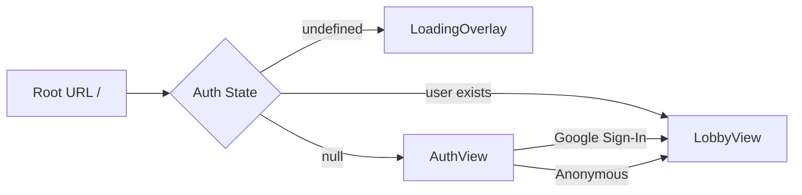
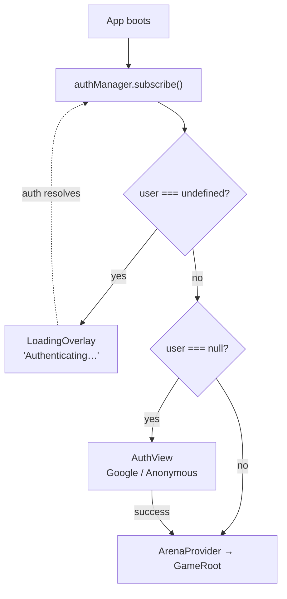
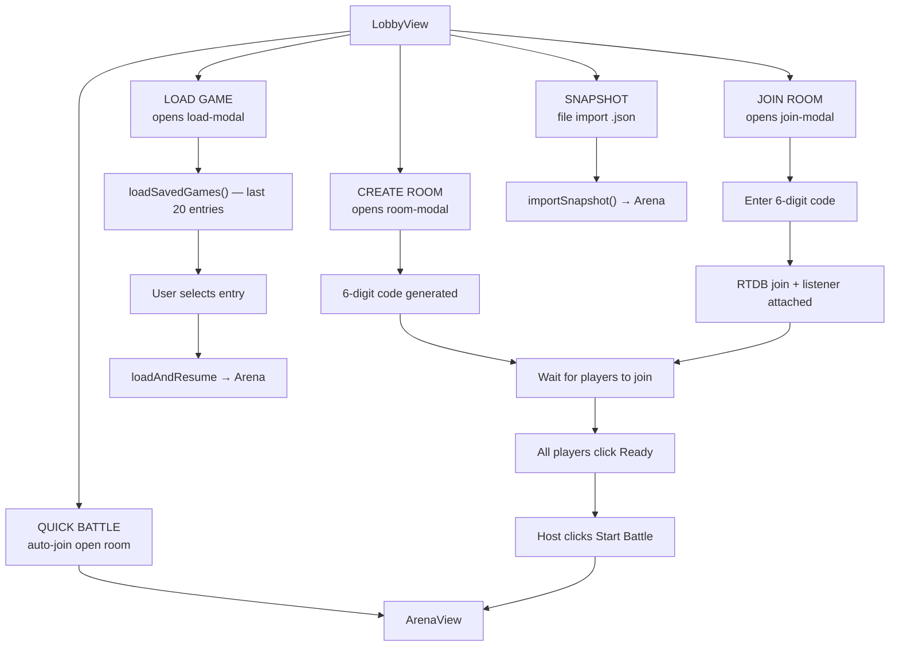
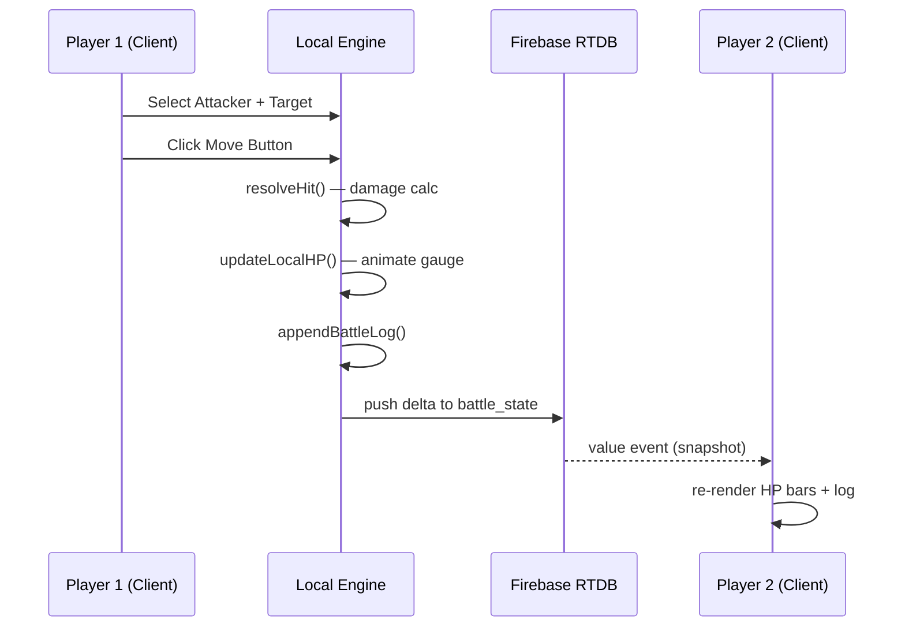
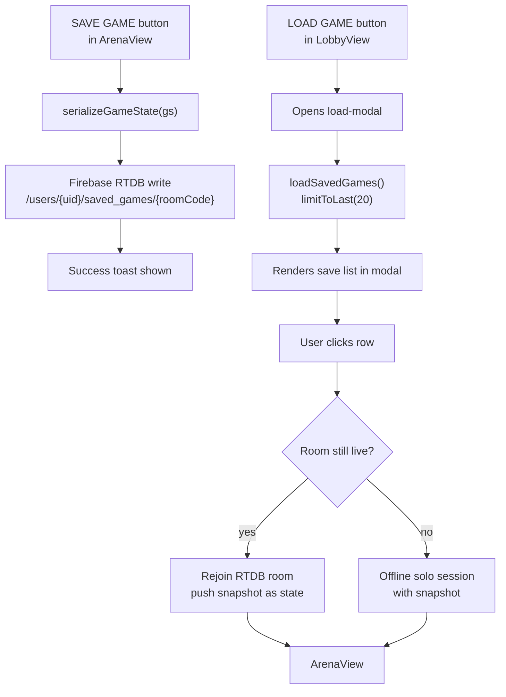
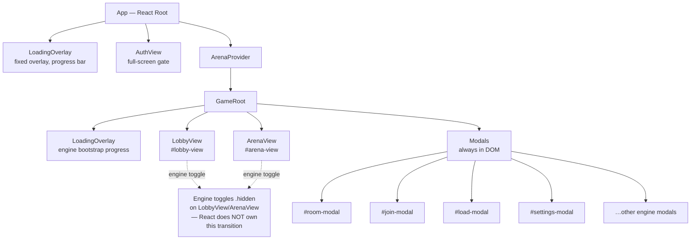
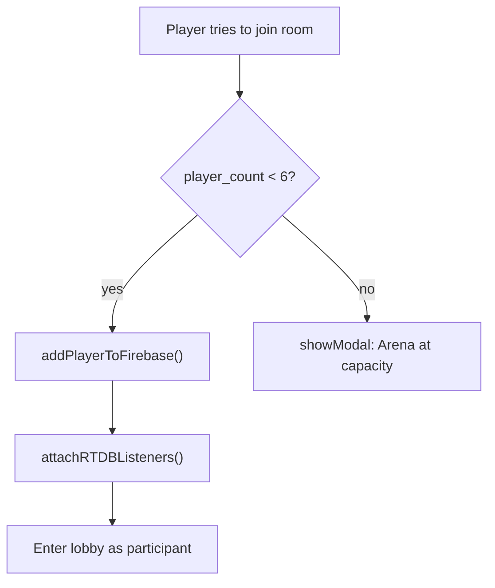
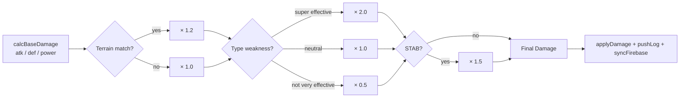
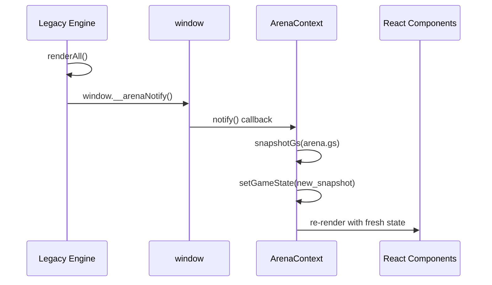

# Application Flow — Pokémon Battle Arena

**Last Updated**: 2026-04-13

---

## 1. Entry Points



| Entry | Behavior |
|-------|----------|
| Root URL `/` | App mounts → auth check → AuthView or LobbyView |
| `?room=XXXXXX` deep link | Reserved for future — not yet implemented; currently lands on Lobby |
| Returning signed-in user | Firebase `onAuthStateChanged` fires with cached user → skips AuthView |

---

## 2. Authentication Gate



Full text description:
```
App boots
  └─ authManager.subscribe()
       ├─ user === undefined  →  <LoadingOverlay label="Authenticating…" />
       ├─ user === null       →  <AuthView />  (Google Sign-In / Anonymous)
       └─ user exists         →  <ArenaProvider> → <GameRoot>
```

`authManager` wraps Firebase Auth. On success it calls `updateProfile` to persist
the trainer display name. Anonymous users get the label **GUEST TRAINER** in the header.

---

## 3. Core User Flows

### Flow 1 — Lobby



**Create Room happy path**
1. `multiplayer.createRoom()` → writes host node to `/rooms/{code}`
2. RTDB listener attaches; player added to room's player list
3. Other players join via JOIN ROOM with the displayed 6-digit code
4. Host sees all players + **Ready** toggles; clicks **Start Battle**
5. Room `status` set to `active`; all clients transition to ArenaView

**Error states**
| Condition | UI |
|-----------|----|
| Name < 2 or > 12 chars | Alert toast |
| Room code not found | "Room not found" toast |
| Room full (6/6) | Modal "Arena is at capacity" |

---

### Flow 2 — Arena

```
LobbyView (all players ready + host starts)
  └─ ArenaView renders  (was already in DOM, engine toggles #arena-view visibility)
       ├─ Player Grid (1–6 player cards)
       ├─ Arena Control Footer
       │    ├─ Attacker Picker (PokemonPicker, all active players)
       │    ├─ Target Picker   (PokemonPicker, all active players)
       │    ├─ Move Buttons    (Physical / Special / Status)
       │    ├─ Management Panel (Evolve / Devolve / Revive / Terrain)
       │    └─ Battle Log Panel (scrolling terminal, color-coded entries)
       └─ Modals (always in DOM, toggled by .visible class)
```

**Turn execution — happy path**



1. Player selects **Attacker** sprite in picker
2. Player selects **Target** sprite in picker
3. Player clicks a **Move** button
4. `arena.handleAttack('physical')` (or `'special'`)
5. Engine resolves damage: `type effectiveness × STAB × terrain multiplier`
6. `updateLocalHP()` → HP gauge animates
7. Damage number popup floats above target card
8. Battle log entry appended (color-coded: red = damage, green = heal, yellow = status)
9. Delta pushed to Firebase → all other clients receive `value` update
10. Remote clients re-render HP bars and log

**Edge cases**
| Case | Resolution |
|------|------------|
| Simultaneous writes | Firebase `transaction()` on `battle_state/actions` |
| Terrain shift | Background parallax layer swaps; 20% type-match boost applied to next calc |
| Player fainted | `.faint-animation` plays; SwitchView prompt appears |
| Player disconnected > 30s | `lastAction` timeout → turn skipped automatically |

---

## 4. Save / Load Flow



**Snapshot Import/Export** (offline, no Firebase)
- Export: serializes `gs` to `.json` download
- Import: file picker reads `.json` → `importSnapshot()` → hydrates arena state

---

## 5. Navigation Map



React does **not** own the Lobby ↔ Arena transition. The legacy JS engine calls `classList.toggle('hidden')` on `#lobby-view` / `#arena-view`. React state (via `ArenaContext`) mirrors `window.arena.gs` via `window.__arenaNotify`.

---

## 6. Screen Inventory

### AuthView
- **Access**: Unauthenticated users
- **Actions**: Google Sign-In, Anonymous Sign-In
- **Exit**: any successful auth → LobbyView

### LobbyView (`#lobby-view`)
- **Access**: Any authenticated user
- **Actions**: `quickBattle()`, open modals (room / join / load), update trainer name, logout
- **States**: idle

### ArenaView (`#arena-view`)
- **Access**: Room-joined, room `status === 'active'`
- **Actions**: `handleAttack()`, `endRound()`, `updateStat()`, evolve/devolve/revive, terrain shift, save game, undo/redo, export log
- **States**: Active, Resolving, Fainted (per player), Victory

---

## 7. Decision Logic

### Room Join Gate



### Damage Resolution



### ArenaContext ↔ Engine Bridge



---

## 8. Error Handling

| Error | Display | Recovery |
|-------|---------|----------|
| Firebase `auth/network-request-failed` | Toast "Connection error" | Retry on next action |
| Room not found | Toast "Arena code invalid" | Reset to LobbyView |
| Engine bootstrap timeout (30s) | Full-screen error with console hint | Hard reload |
| Desync detected | "DESYNC DETECTED" in terminal | `once('value')` fetch → force reconcile |

---

## 9. Responsive Behavior

| Viewport | Player Grid | Battle Log | Footer |
|----------|-------------|------------|--------|
| < 480px (phone portrait) | 1 col | Hidden | Auto-height, 1-col controls |
| 480–680px (phone landscape) | 2 col | Hidden | Auto-height, 2-col controls |
| 680–1024px (tablet) | 2 col | 220px wide | Auto-height, 2-col controls |
| 1024–1400px (MacBook Air) | 3 col | 300px | 380px fixed |
| 1400–1800px (desktop) | 4 col | 420px | 400px fixed |
| 1800px+ (large monitor) | 6 col | 500px | 400px fixed |

---

## 10. Animations & Transitions

| Event | Animation |
|-------|-----------|
| Lobby → Arena | Engine DOM toggle; CSS fade |
| HP change | Radial gauge needle eases (0.8s cubic-bezier) |
| Damage received | `.damage-animation` (shake, 0.3s) |
| Heal received | `.heal-animation` (green glow, 0.8s) |
| Faint | `.faint-animation` (rotate + scale-out, 0.8s, forwards) |
| Damage number | Float upward, scale in then out (1.2s) |
| Active turn card | `pulse-yellow` glow (1.5s infinite) |
| Pokémon switch-in | `switch-in` scale 0→1 (0.4s) |
| Terrain change | Parallax background layer cross-fade |
