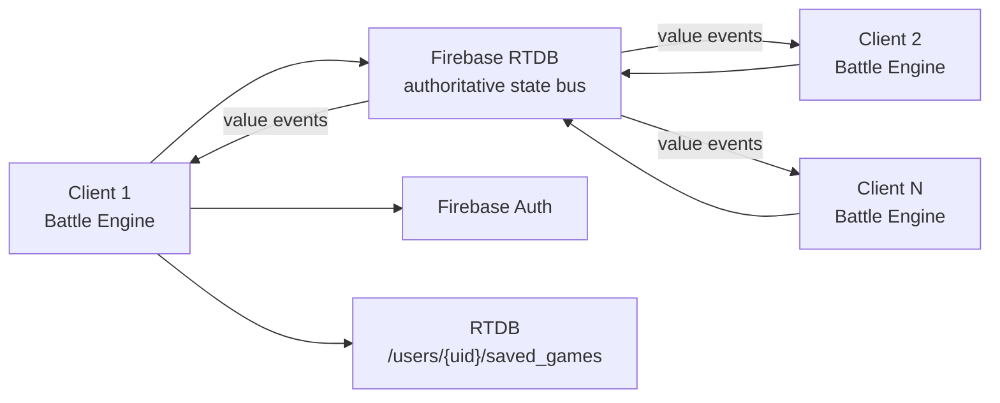
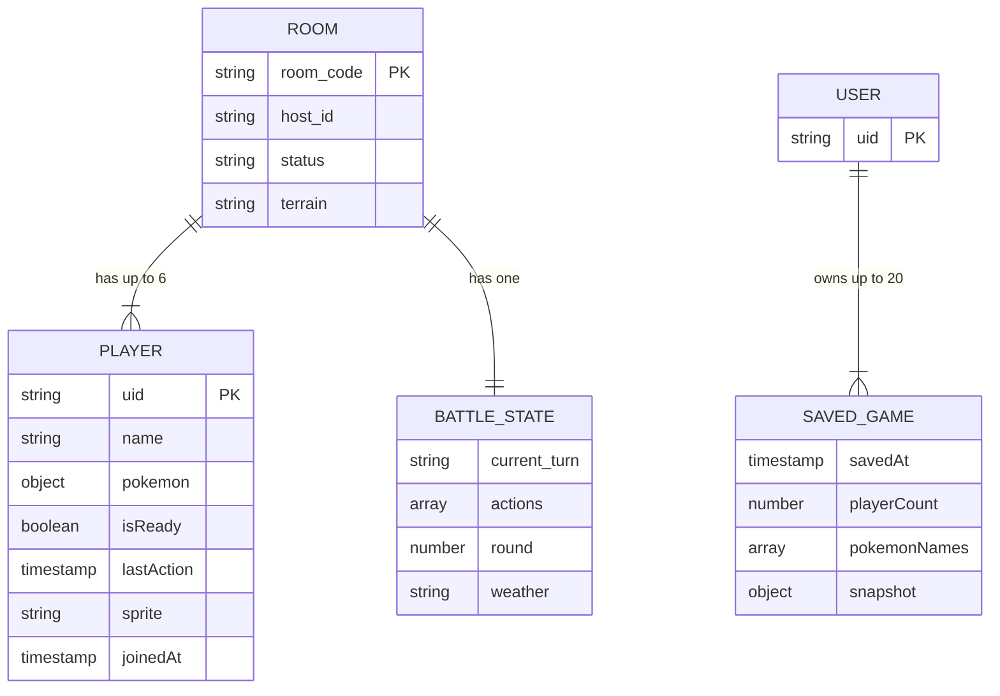
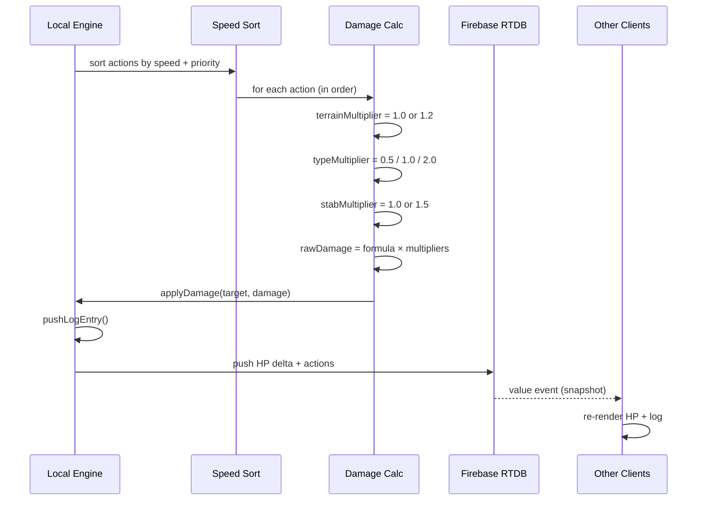
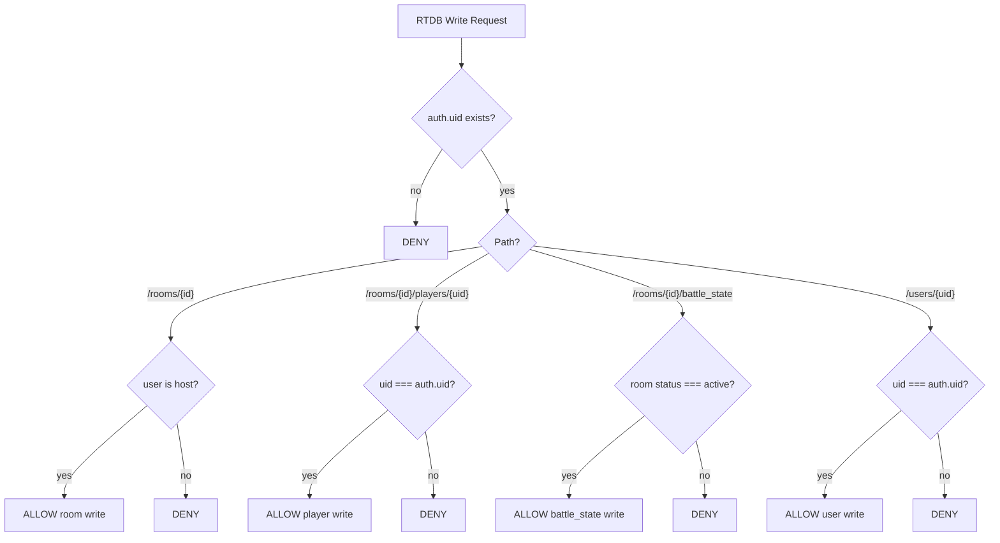

# Backend Structure — Pokémon Battle Arena

**Last Updated**: 2026-04-13

---

## 1. Architecture Model



**Thick Client / Thin Sync Server**

| Responsibility | Where |
|----------------|-------|
| Battle logic (damage, status, terrain, speed tiers) | Client — `src/js/main.js` + `src/js/services/` |
| Authoritative state storage | Firebase RTDB — all clients converge on the same snapshot |
| Save/load persistence | Firebase RTDB — `/users/{uid}/saved_games/` |
| Authentication | Firebase Auth — Google Sign-In and Anonymous |

No backend server processes damage. The first client to `transaction()` a move wins; other clients reconcile from the resulting snapshot.

---

## 2. Firebase Project

| Setting | Value |
|---------|-------|
| Project ID | `pokemon-1248` |
| Auth Domain | `pokemon-1248.firebaseapp.com` |
| RTDB URL | `https://pokemon-1248-default-rtdb.firebaseio.com` |
| Storage Bucket | `pokemon-1248.firebasestorage.app` |
| Measurement ID | `G-G07TP1ENV6` |
| App ID | `1:185001376620:web:4358f1204a5fe1a7615149` |

---

## 3. Database Schema (RTDB NoSQL)



### `/rooms/{room_id}`

| Field | Type | Constraint | Description |
|-------|------|------------|-------------|
| `room_code` | string | 6 chars, unique | The 6-digit join code (same as key) |
| `host_id` | string | not null | Firebase Auth UID of the creator |
| `status` | string | `lobby` \| `active` \| `ended` | Current room phase |
| `terrain` | string | one of 18 types | Active battle terrain |

### `/rooms/{room_id}/players/{uid}`

| Field | Type | Constraint | Description |
|-------|------|------------|-------------|
| `name` | string | 2–12 chars | Trainer display name |
| `pokemon` | object | see Pokemon model | Current active Pokémon stats |
| `isReady` | boolean | default: false | Readiness flag for battle start |
| `lastAction` | timestamp | milliseconds | Timeout detection (> 30s = disconnected) |
| `sprite` | string | pokémon slug | Selected sprite identifier |
| `joinedAt` | timestamp | milliseconds | Join time for ordering |

### `/rooms/{room_id}/battle_state`

| Field | Type | Description |
|-------|------|-------------|
| `current_turn` | string | UID of the player whose turn it is |
| `actions` | array | Queue of committed moves this round |
| `round` | number | Current round counter |
| `weather` | string | Active weather condition |

### `/users/{uid}/saved_games/{room_code}`

| Field | Type | Description |
|-------|------|-------------|
| `savedAt` | timestamp | When the save was created |
| `playerCount` | number | Players in the session at save time |
| `pokémonNames` | array\<string\> | Display names for the load menu |
| `snapshot` | object | Full serialized `gs` (game state) |

---

## 4. API & Event Contracts

### Event: `join_room`
**Firebase `set` → `/rooms/{room_id}/players/{uid}`**
```json
{
  "name": "Ash",
  "sprite": "pikachu",
  "isReady": false,
  "joinedAt": 1712123456789
}
```

### Event: `commit_move`
**Firebase `update` → `/rooms/{room_id}/battle_state`**
```json
{
  "current_turn": "uid_of_player",
  "actions": [
    {
      "playerId": "uid_of_player",
      "moveCategory": "special",
      "attackerId": "player_1_slot_0",
      "targetId": "player_2_slot_0",
      "timestamp": 1712123456790
    }
  ]
}
```

**Response (RTDB `value` sync)**
All clients receive the updated `battle_state` snapshot and begin local resolution.

### Event: `save_game`
**Firebase `set` → `/users/{uid}/saved_games/{room_code}`**
```json
{
  "savedAt": 1712123456800,
  "playerCount": 3,
  "pokémonNames": ["Pikachu", "Charizard", "Gengar"],
  "snapshot": { "...full gs..." }
}
```

### Event: `load_saved_games`
**Firebase `limitToLast(20)` listener → `/users/{uid}/saved_games`**
Returns up to 20 saves. `loadAndResume(roomCode)` then fetches the snapshot and applies it.

---

## 5. Logic Resolution Sequence



### Pre-Turn
1. Sort all queued `actions` by `speed` stat (descending) + move priority
2. Apply terrain boost: 20% to primary stats if player's move type matches current terrain
3. Check weather effects on status

### Damage Calculation (per action in sorted order)
```javascript
// Executed client-side in resolveHit()
const terrainMultiplier = (move.type === terrain.type) ? 1.2 : 1.0;
const typeMultiplier    = getTypeEffectiveness(move.type, target.types); // 0.5, 1, 2
const stabMultiplier    = target.types.includes(move.type) ? 1.5 : 1.0;

const rawDamage = ((2 * attacker.level / 5 + 2)
    * move.power * (attacker.atk / target.def) / 50) + 2;
const damage = Math.floor(rawDamage * terrainMultiplier * typeMultiplier * stabMultiplier);

applyDamage(target, damage);
pushLogEntry(attacker.name, move.name, damage, flags);
```

### Post-Turn Sync
1. Local HP delta pushed to Firebase: `/rooms/{room_id}/players/{uid}/pokemon/hp`
2. Faint check: if `hp <= 0` → trigger SwitchView, mark as fainted
3. Round end: if all actions resolved → increment `round`, clear `actions`, advance `current_turn`

### Reconnect / Inconsistent State
- On component mount: `once('value')` fetch of full `battle_state` snapshot
- Forces React re-render of all HP bars and status effects
- If `players/{uid}/lastAction` age > 30s → mark Disconnected, skip turn

---

## 6. socketClient.js — Key Functions

Located at `src/js/api/socketClient.js`. This is the multiplayer coordination layer.

| Function | Action |
|----------|--------|
| `quickBattle()` | Finds or creates an open room; auto-joins |
| `createRoom()` | Writes host node; attaches RTDB listeners |
| `joinRoom(code)` | Joins existing room by 6-digit code |
| `listenToRoom(id)` | Attaches `on('value')` listeners for player/battle state sync |
| `saveGameToFirebase()` | Serializes `gs` → writes to `/users/{uid}/saved_games/{code}` |
| `loadSavedGames()` | Reads `limitToLast(20)` → populates `#load-game-list` |
| `loadAndResume(code)` | Fetches snapshot → rejoins live room or creates offline session |
| `importSnapshot(file)` | Reads JSON file → hydrates arena state |
| `exportSnapshot()` | Serializes `gs` → triggers browser download |

---

## 7. Firebase Security Rules



```json
{
  "rules": {
    "rooms": {
      "$room_id": {
        ".read": "true",
        ".write": "!data.exists() || data.child('host_id').val() === auth.uid",
        "players": {
          "$uid": {
            ".read": "true",
            ".write": "$uid === auth.uid"
          }
        },
        "battle_state": {
          ".write": "data.parent().child('status').val() === 'active'"
        }
      }
    },
    "users": {
      "$uid": {
        ".read": "$uid === auth.uid",
        ".write": "$uid === auth.uid"
      }
    }
  }
}
```

**Intent of each rule:**
- `rooms/$room_id .read: true` — anyone can observe a room (spectate lobby)
- `rooms/$room_id .write` — only creator can write the room root
- `players/$uid .write: $uid === auth.uid` — each player controls only their own node
- `battle_state .write` — only writable when room is active (prevents pre-game manipulation)
- `users/$uid` — each user's saves are private; no cross-user read/write

---

## 8. Conflict Resolution

| Scenario | Strategy |
|----------|----------|
| Simultaneous move submissions | `transaction()` on `battle_state/actions` — first write wins |
| Player reconnects mid-round | `once('value')` snapshot fetch reconciles all missed updates |
| Player drops > 30s | `lastAction` TTL check in engine — turn auto-skipped |
| Out-of-order message | Firebase RTDB delivers ordered; timestamp in action used for tie-break |
| Client crash during save | Next `saveGameToFirebase()` call overwrites; no partial-write risk because RTDB set is atomic |

---

## 9. Performance Limits

| Limit | Value | Enforcement |
|-------|-------|-------------|
| Players per room | 6 | Engine-side check at join |
| Battle state payload | < 64KB | Design constraint; monitor during dev |
| Write frequency | 200ms debounce per player | Engine-side throttle |
| Saved games returned | 20 | `limitToLast(20)` RTDB query |
| Room timeout | Not yet implemented | Planned: Cloud Function to clean rooms after 24h |
