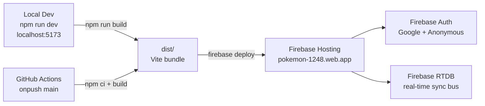
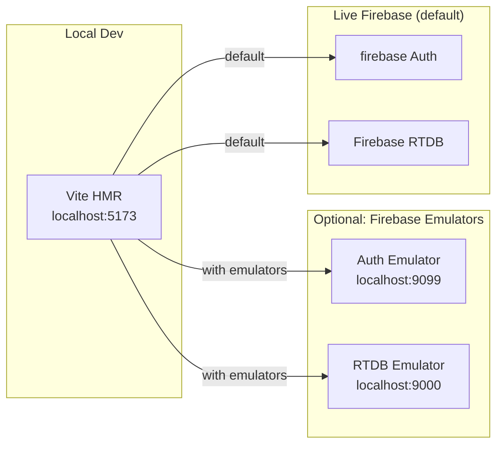
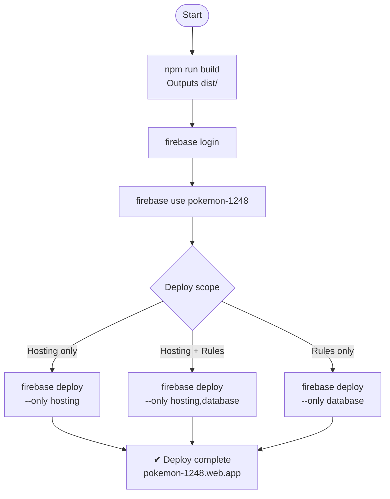
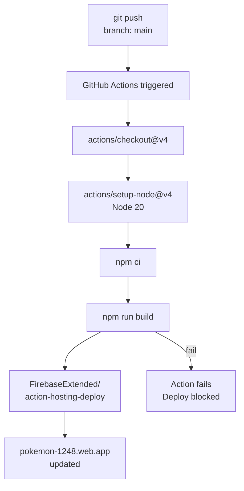

# Deployment Guide — Pokémon Battle Arena

**Last Updated**: 2026-04-13

---

## Overview



---

## 1. Prerequisites

| Tool | Version | Install |
|------|---------|---------|
| Node.js | 20+ | https://nodejs.org |
| npm | 10+ | bundled with Node |
| Firebase CLI | 13+ | `npm install -g firebase-tools` |
| Firebase account | — | https://console.firebase.google.com |

---

## 2. First-Time Setup

### 2.1 Clone & Install
```powershell
git clone <repo-url>
cd pokemon-battle-arena-main
npm install
```

### 2.2 Firebase Login
```powershell
firebase login
```
Authenticate with the Google account that owns the `pokemon-1248` Firebase project.

### 2.3 Link Firebase Project
```powershell
firebase use pokemon-1248
```
Or create a `.firebaserc` if it doesn't exist:
```json
{
  "projects": {
    "default": "pokemon-1248"
  }
}
```

---

## 3. Environment Configuration

**No `.env` file is required.** Firebase config is hardcoded in `src/firebase.js` (public API key — safe for Firebase projects because security is enforced by RTDB rules, not by key secrecy).

If you need to point to a different Firebase project, update `src/firebase.js` with the target project's config object from the Firebase console.

---

## 4. Local Development



```powershell
npm run dev
```

- Opens at `http://localhost:5173` (Vite default)
- HMR active — most changes hot-reload without losing React state
- Connects to the **live** Firebase project (not a local emulator)

### Optional: Firebase Emulator Suite
To avoid touching production data during development:
```powershell
firebase emulators:start --only database,auth
```
Then update `src/firebase.js` to point to emulator URLs:
```javascript
// Add after initializeApp()
if (import.meta.env.DEV) {
  connectDatabaseEmulator(db, 'localhost', 9000);
  connectAuthEmulator(auth, 'http://localhost:9099');
}
```
> Not configured by default. Do this before testing large multi-player flows.

---

## 5. Building for Production

```powershell
npm run build
```

Output: `dist/` directory. Vite bundles all assets with content hashes.

**Expected output:**
```
dist/
├── index.html
├── assets/
│   ├── index-[hash].js       (~3MB+ due to large data files)
│   ├── index-[hash].css
│   └── [other chunks]
```

> The large data files (`movesets.js`, `pokemon_data.js`, etc.) are the main bundle contributors. Bundle splitting or lazy import is a future optimization.

Preview the production build locally:
```powershell
npm run preview
```

---

## 6. Deploying to Firebase Hosting



### One-step deploy (build + deploy)
```powershell
npm run build
firebase deploy --only hosting
```

### Hosting-only deploy (if build already done)
```powershell
firebase deploy --only hosting
```

### Deploy hosting + RTDB rules together
```powershell
firebase deploy --only hosting,database
```

**Expected output:**
```
✔  Deploy complete!

Project Console: https://console.firebase.google.com/project/pokemon-1248
Hosting URL: https://pokemon-1248.web.app
```

---

## 7. Firebase Configuration Files

### `firebase.json`
```json
{
  "hosting": {
    "public": "dist",
    "ignore": ["firebase.json", "**/.*", "**/node_modules/**"],
    "rewrites": [
      { "source": "**", "destination": "/index.html" }
    ]
  },
  "database": {
    "rules": "database.rules.json"
  }
}
```

### `database.rules.json`
Security rules for RTDB. Deploy with:
```powershell
firebase deploy --only database
```
See BACKEND_STRUCTURE.md for the full rules content.

---

## 8. CI / CD (GitHub Actions)



No active workflow file is currently configured. To set one up:

```yaml
# .github/workflows/deploy.yml
name: Deploy to Firebase
on:
  push:
    branches: [main]

jobs:
  deploy:
    runs-on: ubuntu-latest
    steps:
      - uses: actions/checkout@v4
      - uses: actions/setup-node@v4
        with:
          node-version: 20
      - run: npm ci
      - run: npm run build
      - uses: FirebaseExtended/action-hosting-deploy@v0
        with:
          repoToken: ${{ secrets.GITHUB_TOKEN }}
          firebaseServiceAccount: ${{ secrets.FIREBASE_SERVICE_ACCOUNT }}
          channelId: live
          projectId: pokemon-1248
```

Required secrets: `FIREBASE_SERVICE_ACCOUNT` (JSON key from Firebase console → Project Settings → Service Accounts).

---

## 9. Post-Deploy Verification

```mermaid
flowchart TD
    Deploy["Deploy complete"] --> A["1. Open incognito\npokemon-1248.web.app"]
    A --> B{"AuthView shown?"}
    B -- no --> FAIL1["❌ Check bundle\nconsole errors"]
    B -- yes --> C["2. Sign in Google / Guest"]
    C --> D{"LobbyView loads?"}
    D -- no --> FAIL2["❌ Check RTDB rules\ndatabase.rules.json"]
    D -- yes --> E["3. Create Room\ncheck 6-digit code"]
    E --> F["4. Join on 2nd tab\nenter code"]
    F --> G{"Both players visible?"}
    G -- no --> FAIL3["❌ Check RTDB\nplayers listener"]
    G -- yes --> H["5. Both Ready → Start Battle"]
    H --> I["6. Execute move\ncheck HP animation + log"]
    I --> J{"Sync on both clients?"]
    J -- no --> FAIL4["❌ Check battle_state\nwrite rule + status active"]
    J -- yes --> K["7. Save Game\ncheck RTDB /saved_games"]
    K --> PASS["✅ All checks passed"]
```

After every deploy, verify:

1. **Auth gate** — open `https://pokemon-1248.web.app` in an incognito window; AuthView appears
2. **Google Sign-In** — sign in; lobby loads with trainer name displayed
3. **Create Room** — click Create; modal opens; 6-digit code appears
4. **Join Room** — on a second device/tab, enter the code; both players appear in lobby
5. **Battle start** — both ready; host starts; ArenaView loads with player cards
6. **Move execution** — execute a move; HP bar animates; log entry appears on both clients
7. **Save Game** — click Save; Firebase console → RTDB → `/users/{uid}/saved_games` shows entry

---

## 10. Rollback

Firebase Hosting keeps the last 5 deploys. Roll back via CLI:
```powershell
firebase hosting:clone pokemon-1248:live pokemon-1248:live --version <version-id>
```
Or via the Firebase console → Hosting → Release History → Roll back.

---

## 11. Common Issues

| Symptom | Cause | Fix |
|---------|-------|-----|
| Blank white screen | JS bundle error | Check browser console; often a missing env var or bad import path |
| Auth loop | RTDB rules block read on first mount | Check `database.rules.json` is deployed |
| "Arena failed to initialise within 30s" | `window.arena` not set; large data file timeout | Check `src/js/main.js` bootstrap; increase timeout in `ArenaContext.jsx` if data files are slow |
| HP changes don't sync | RTDB rule blocks write | Ensure `status === 'active'` is set on the room node before battle starts |
| Build > 5MB | Large data files | Expected. Lazy-load data modules in future; no fix needed for MVP |