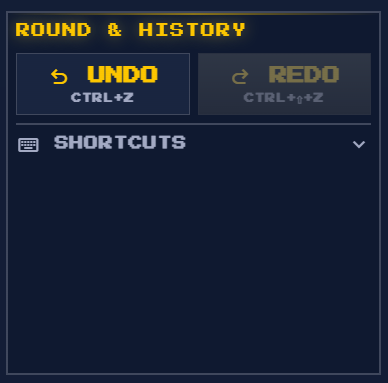

# Agentic Development Workflow

This project follows an **AI-First / Agent-Assisted** development methodology. All major features, architectural shifts, and data migrations are executed by the **Antigravity AI Agent** using a centralized library of global skills.

## 1. Governance Model

- **Documentation-First**: No major code change is permitted without a corresponding research phase and an updated technical specification.
- **Atomic Execution**: Tasks are broken down into verifiable sub-steps documented in a persistent `task.md`.
- **Peer-Review (Agent/Human)**: The AI agent proposes implementation plans which require human approval before execution.

## 2. Integrated Global Skills

The project leverages a specialized set of global skills stored in `C:\Users\honey\.gemini\antigravity\skills`. These skills provide high-fidelity logic for specific domains:

### UI & Aesthetics
- **`pixel-retro-design`**: Ensures all new components adhere to the "Indigo Plateau" glassmorphism and pixel-art aesthetic.
- **`animejs-animation`**: Powers the high-performance CSS and JS animations used for HP transitions and battle effects.

### Quality & Reliability
- **`systematic-debugging`**: A structured approach to resolving synchronization and physics engine bugs.
- **`tdd-workflow`**: Ensures all core battle logic (damage, terrain boosts) is covered by unit tests.

### Platform Scalability
- **`mobile-design`**: Guarantees that the complex 6-player arena remains usable on small touchscreens.

## 3. Automation Benchmarks

| Activity | Agent Role | Human Role |
|----------|------------|------------|
| **Feature Scoping** | Drafts PRD & App Flow | Reviews & Approves |
| **Logic Implementation** | Writes JS / React Code | Code Review & Audit |
| **Data Verification** | Scripted audits and fixes | Spot checks & feedback |
| **Deployment** | Build, Git Push, Firebase Deploy | Final Live Approval |

---
**Last Updated**: 2026-04-03  
**Status**: Formalized
