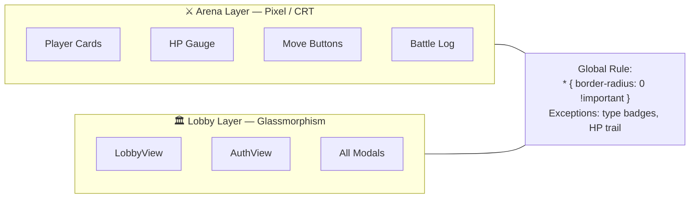
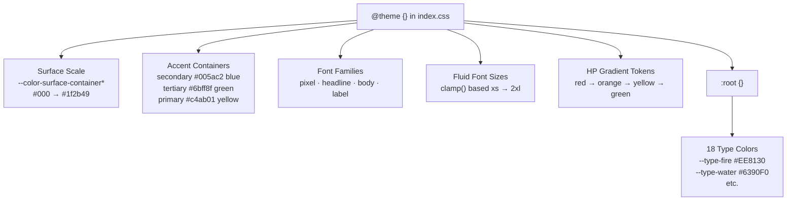
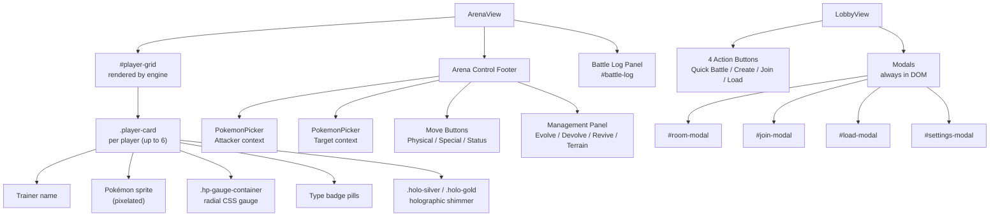
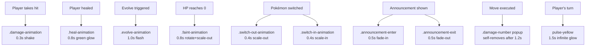
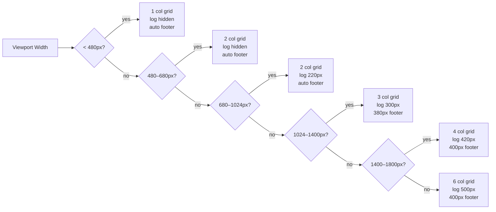

# Frontend Guidelines — Pokémon Battle Arena

**Last Updated**: 2026-04-13

---

## 1. Design Philosophy

Two aesthetics coexist and must never conflict:



| Layer | Aesthetic | Where |
|-------|-----------|-------|
| Arena (battle) | Retro pixel / CRT | Player cards, HP gauge, move buttons, battle log |
| Lobby / Modals | Dark glassmorphism / Indigo Plateau | LobbyView, AuthView, all modals |

The rule: **sharp pixel edges in the arena; glass panels in the lobby.** Global CSS enforces `* { border-radius: 0 !important }` — the only exception is elements that explicitly override with `!important` for pill shapes (type badges, HP trail).

---

## 2. Design Tokens

All tokens live in the `@theme {}` block at the top of `src/index.css`. They compile to Tailwind utility classes and CSS custom properties simultaneously.



### Color System
```css
@theme {
  /* Surface scale — dark blue */
  --color-surface-container-lowest:    #000000;
  --color-surface-container:           #0f1930;
  --color-surface-container-low:       #091328;
  --color-surface-container-high:      #141f38;
  --color-surface-container-highest:   #192540;
  --color-surface-bright:              #1f2b49;
  --color-surface-variant:             #192540;

  /* On-surface */
  --color-on-surface-variant:          #a3aac4;
  --color-outline-variant:             #40485d;

  /* Accent containers */
  --color-secondary-container:         #005ac2;   /* blue — Join Room button */
  --color-on-secondary-container:      #f7f7ff;
  --color-tertiary-container:          #6bff8f;   /* green — Quick Battle button */
  --color-on-tertiary-container:       #005f28;
  --color-primary-container:           #c4ab01;   /* yellow — active highlights */
}
```

### Pokémon Type Colors
Defined as CSS custom properties in `:root`:
```css
--type-normal: #A8A77A;  --type-fire: #EE8130;   --type-water: #6390F0;
--type-electric: #F7D02C; --type-grass: #7AC74C; --type-ice: #96D9D6;
/* … all 18 types */
```
Used by type badges and entry animations. Reference via `var(--type-{name})`.

### HP Gradient
```css
--hp-color-red:          #e63946;
--hp-color-orange:       #f77f00;
--hp-color-yellow-orange:#fcbf49;
--hp-color-yellow:       #ffdd00;
--hp-color-yellow-green: #a9dc4c;
--hp-color-green:        #4caf50;
```
HP gauge segments cycle through these as HP decreases. Never use raw hex — always use these tokens to keep the gauge consistent.

### Typography Tokens
```css
@theme {
  --font-pixel:    "Press Start 2P", cursive;
  --font-headline: "Space Grotesk", sans-serif;
  --font-body:     "Manrope", sans-serif;
  --font-label:    "Press Start 2P", cursive;
}
```

| Class | Font | Use |
|-------|------|-----|
| `font-pixel` / `font-label` | Press Start 2P | Arena labels, terminal output, all pixel UI |
| `font-headline` | Space Grotesk | Page headings (h1 in LobbyView header) |
| `font-body` | Manrope | Descriptive text, tooltip copy |

**Do not use system fonts for visible UI.** `body` is set to `Press Start 2P` globally; `font-smoothing` is disabled for pixel sharpness.

### Fluid Font Sizes
```css
--font-size-xs:   clamp(0.6rem,  1.5vw, 1rem);
--font-size-sm:   clamp(0.75rem, 2vw,   1.1rem);
--font-size-base: clamp(0.875rem,2.5vw, 1.4rem);
--font-size-lg:   clamp(1rem,    3vw,   1.8rem);
--font-size-xl:   clamp(1.125rem,4vw,   2.2rem);
--font-size-2xl:  clamp(1.25rem, 5vw,   2.5rem);
```
Always use these tokens via `var()` — never raw `px` or `rem` for text in arena components.

---

## 3. Core CSS Utilities

Defined in `src/index.css` and used as plain class names in JSX:

| Class | Effect |
|-------|--------|
| `.pixel-grid` | 4px CRT grid overlay (pointer-events: none) |
| `.text-glow` | Yellow neon glow: `text-shadow: 0 0 15px rgba(252,223,70,0.5)` |
| `.hard-shadow-tertiary` | `box-shadow: 4px 4px 0px 0px #006a2d` — lobbybutton pixel offset |
| `.hard-shadow-secondary` | `box-shadow: 4px 4px 0px 0px #004da8` |
| `.hard-shadow-outline` | `box-shadow: 4px 4px 0px 0px #40485d` |
| `.step-animation` | `:active { transform: scale(0.95) }` — press-down tactile feel |
| `.custom-scrollbar` | Thin, styled scrollbar matching dark palette |

---

## 4. Component Reference



### 4.1 Player Card (`.player-card`)
- Rendered by the legacy engine into `#player-grid`
- `flex: 1 1 220px; max-width: 420px` — fills grid naturally; never text-wraps under 220px
- Border is a `border-image-source: linear-gradient(…)` (4px) updated by JS for state
- States applied by JS:
  - `.active-turn` — amber pulsing glow (`pulse-yellow` animation)
  - `.selected-target` — red glow
  - `.selected-status-target` — purple glow
- Holographic shimmer for rare Pokémon: `.holo-silver` / `.holo-gold` via `::before` pseudo
- Gold glitter overlay: `.card-glitter.gold-glitter`

### 4.2 HP Gauge (`.hp-gauge-container`)
- Radial segmented gauge built from CSS only (no SVG, no `<canvas>`)
- Needle rotation set via inline `style.transform` by JS
- Center circle shows numeric HP / Max HP; click-editable
- Segment colors pulled from `--hp-color-*` tokens
- Size: `clamp(120px, 20vw, 220px)` (scales with viewport)

### 4.3 PokemonPicker (`src/components/PokemonPicker.jsx`)
- Horizontal flex strip, `overflow-x: auto; scrollbar-width: none`
- Each sprite: 44px, `image-rendering: pixelated`
- Selection state: `ring-2 ring-yellow-400 bg-yellow-500/20`
- Contexts:
  - **Attacker**: all active players' current Pokémon
  - **Target**: all active players' current Pokémon
  - **Status**: all active players
  - **Management**: only the acting player's team

### 4.4 Battle Log (`#battle-log`)
- Scrollable terminal panel (`.battle-log-panel { width: 500px }`)
- Custom scrollbar: `scrollbar-width: thin; scrollbar-color: #475569 #1e293b`
- Log entry color classes:
  - `.log-entry-action` — white
  - `.log-entry-damage` — red `#ef4444`
  - `.log-entry-heal` — green `#22c55e`
  - `.log-entry-status` — yellow `#facc15`
  - `.log-entry-round` — blue `#60a5fa` (bold)
  - `.log-entry-system` — muted grey (italic)
- Hover: `border-left: 3px solid #f59e0b`; `background-color: rgba(71,85,105,0.3)`

### 4.5 Modals (`.modal-overlay`)
- Default: `opacity: 0; pointer-events: none`
- Triggered: engine adds `.visible` class → `opacity: 1; pointer-events: auto`
- Inner `.modal-content` scales from 0.95 → 1 on open (CSS transition 0.3s)
- Always in DOM (no conditional render) — engine needs stable DOM references

### 4.6 Action Buttons
- Physical/Special/Status: pill shape (`border-radius: 9999px !important`)
- Gradient fills per action type (red for physical, blue for special, etc.)
- `text-shadow` borders on all button text for readability over gradients
- `:active { transform: scale(0.95) }` — via `.step-animation` or direct CSS

### 4.7 Lobby Buttons
- Full-width, no border-radius (global `* { border-radius: 0 !important }`)
- Pixel offset shadow (`hard-shadow-*`)
- `.step-animation:active` for press feedback
- Icon + text label + chevron layout using flexbox

---

## 5. Animation System

All animations are CSS keyframes. Never add JS-driven animation via `requestAnimationFrame` for existing effects — extend CSS instead.



| Animation Class | Trigger | Duration |
|-----------------|---------|----------|
| `.damage-animation` | JS adds on hit | 0.3s shake |
| `.heal-animation` | JS adds on heal | 0.8s green glow |
| `.evolve-animation` | JS adds on evolve | 1.0s flash |
| `.faint-animation` | JS adds when HP = 0 | 0.8s rotate+scale-out (forwards) |
| `.switch-out-animation` | JS adds on switch | 0.4s scale-out |
| `.switch-in-animation` | JS adds on switch | 0.4s scale-in |
| `.announcement-enter/exit` | JS adds on banner show | 0.5s fade-in / 0.5s fade-out |
| `.turn-indicator-arrow` | Engine renders it | `bounce-arrow` 1s infinite |

Damage number popups (`.damage-number`) are injected into the DOM by JS and self-remove after animation ends.

---

## 6. Responsive Strategy

Breakpoints use `max-width` in CSS (not Tailwind `sm:` / `md:` — Tailwind uses min-width). Keep this pattern consistent.



| Viewport | Columns | Battle Log | Footer Height |
|----------|---------|------------|---------------|
| 1800px+ | 6 | 500px | 400px |
| 1400–1800px | 4 | 420px | 400px |
| 1024–1400px | 3 | 300px | 380px |
| 680–1024px | 2 | 220px | auto / max 50vh |
| 480–680px | 2 | hidden | auto / max 45vh |
| < 480px | 1 | hidden | auto / max 40vh |

Touch targets: **48×48px minimum** on all interactive elements. Achieved via `min-w-[80px]` on nav items and explicit padding on buttons.

---

## 7. Background Layers

The arena and lobby each use stacked background divs. Order (back → front):

1. `.bg-arena-animated` — radial gradient, slow pan (15s, fixed position)
2. `.bg-cyber-grid` — perspective grid scrolling down (3s linear infinite)
3. `.bg-energy-glow` — radial yellow pulse centered (6s ease-in-out infinite)
4. CRT scanline overlay — `linear-gradient` stripes, `opacity: 0.03`
5. `.pixel-grid` — 4px grid, `opacity` varies

All background layers are `pointer-events: none` and `position: fixed` or `absolute`.

---

## 8. Accessibility

- Contrast: text on glass panels must meet 4.5:1 ratio. Yellow `#fcdf46` on `#0f1930` dark surfaces passes.
- Motion: `@media (prefers-reduced-motion)` — not yet implemented. **Add for any new pulsing or looping animations.**
- Font-smoothing intentionally disabled for pixel aesthetic; this is acceptable for gaming context.
- All interactive elements have unique IDs for engine targeting (e.g., `#quick-battle-btn`, `#create-room-btn`).

---

## 9. Do / Don't

| Do | Don't |
|----|-------|
| Use `var(--font-size-*)` for arena text | Use raw `px` sizes in player cards |
| Use design token colors from `@theme {}` | Use arbitrary hex values in JSX |
| Add new sprite effects as CSS keyframes | Use JS `setTimeout`-based animations |
| Keep new modals `.modal-overlay` pattern (opacity toggle) | Conditionally render modals in React (breaks engine) |
| Keep `* { border-radius: 0 !important }` intact | Add `rounded-*` classes without `important` |
| Test at 320px wide after any layout change | Assume desktop layout is the baseline |
