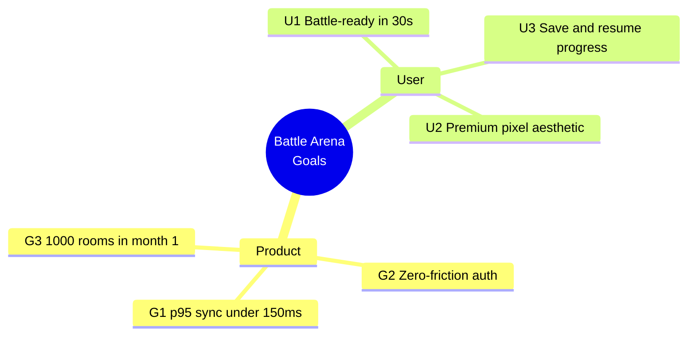
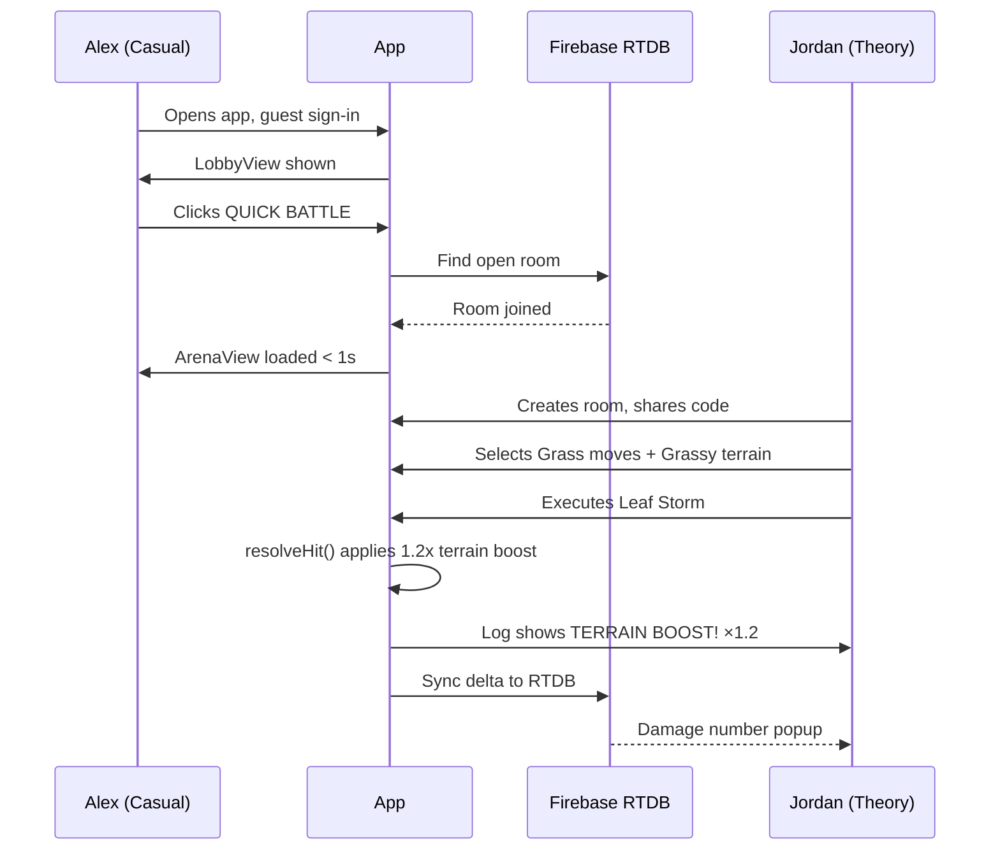
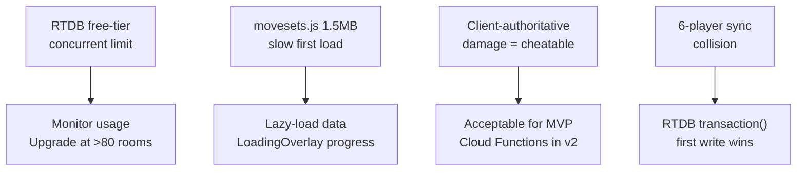

# Product Requirements Document — Pokémon Battle Arena

**Version**: 1.2.0
**Last Updated**: 2026-04-13
**Owner**: Sapeksh

---

## 1. Product Overview

Pokémon Battle Arena is a browser-based, real-time multiplayer battle simulator supporting up to 6 players per room. No native install, no account friction beyond a one-time Google or anonymous sign-in. The aesthetic is a retro pixel-art / CRT hybrid layered on a dark "Indigo Plateau" design system. The engine runs entirely on the client; Firebase Realtime Database (RTDB) is the authoritative state bus.

---

## 2. Problem Statement

Casual Pokémon fans want 5-minute duels with friends. Competitive simulators (Showdown, etc.) are feature-heavy and high-barrier. There is no mid-point: a jump-in, visually premium, mobile-capable browser simulator with real-time sync and zero setup overhead.

---

## 3. Goals

### Business / Product

| # | Goal | Target |
|---|------|--------|
| G1 | < 1s latency for state updates across 6 players | p95 sync < 150ms |
| G2 | Zero-friction entry — no email required | Anonymous auth auto-provisioned |
| G3 | 1,000 unique rooms created within first month post-launch | Firebase Analytics |

### User

| # | Goal |
|---|------|
| U1 | Battle-ready in under 30 seconds from cold page load |
| U2 | Premium "Indigo Plateau" aesthetic — no visual flickering on transitions |
| U3 | Save / load battle state; never lose progress to a tab close |

---

## 4. Success Metrics

| Metric | Target |
|--------|--------|
| Activation Rate | 80% of users who join a room start a battle in < 60s |
| Sync Latency | p95 < 150ms per state push |
| Error Rate | < 1% of moves failing due to sync or engine bugs |
| Retention | 40% of users play 2+ battles per session |

---

## 5. Target Users

### Primary — Alex (Casual Speedster)
- 18–35, mobile-first, likes Pokémon but finds competitive play high-barrier
- Pain: account creation, technical jargon, limited time
- Goal: 5-minute duel on commute with a friend, high-quality sprites and sounds

### Secondary — Jordan (Theory Crafter)
- 20–40, desktop, competitive background
- Pain: simulators miscalculate terrain boosts, lack visual stat-change feedback
- Goal: Precisely verify terrain boost math; synchronized damage logs

---

## 6. Features

```mermaid
flowchart LR
    subgraph P0["P0 — Must Have"]
        Auth["6.1 Firebase Auth\nGoogle + Anonymous"]
        Sync["6.2 6-Player Sync\nRTDB rooms"]
        Engine["6.3 Gen 5 Engine\nPhysical / Special / Status"]
        UI["6.4 Pixel UI\nCRT + glassmorphism"]
        Picker["6.5 PokemonPicker\nsprite selector"]
        SaveLoad["6.6 Save / Load\nFirebase + JSON"]
        Audio["6.7 Tone.js Audio\nbattle music"]
    end
    subgraph P1["P1 — Should Have"]
        Terrain["6.8 Terrain Engine\n18 types, 1.2x boost"]
        History["6.9 Undo / Redo\nbattle history"]
    end
    subgraph P2["P2 — Nice to Have"]
        Replay["Replay Engine"]
        Particles["Particle Effects"]
    end
    P0 --> P1 --> P2
```

### P0 — Must Have (Shipped)

#### 6.1 Firebase Auth
- Google Sign-In and anonymous guest login
- Display-name update from the Lobby (syncs to Firebase Auth `displayName`)
- Auth state gates the whole app — no unauthenticated access to Lobby/Arena

#### 6.2 Real-Time 6-Player Sync
- Rooms created/joined via 6-digit code in Firebase RTDB
- Player list, ready state, and battle state update in < 100ms
- Quick Battle (auto-join any open room) and Create Room (host) and Join Room (code) flows

#### 6.3 Gen 5 Core Battle Engine
- Physical / Special / Status move categories
- Base Power, STAB, 18-type effectiveness, Crit, Burn / Poison / Paralyze resolution
- Speed-tier ordering per round
- HP displayed on radial gauge with color gradient (green → orange → red)

#### 6.4 Responsive Pixel / Indigo Plateau UI
- Retro CRT pixel grid + glassmorphism panels
- Press Start 2P (labels/terminal) + Space Grotesk (headlines) + Manrope (body)
- Fluid `clamp()`-based font sizes; fully responsive from 320px phones to 4K monitors
- 5-breakpoint grid: 1 / 2 / 3 / 4 / 6 columns based on viewport width

#### 6.5 Sprite-Only Pokémon Selectors (PokemonPicker)
- Horizontal scrollable strip of 44px sprites — no text labels or HP bars
- Yellow `ring` highlight on selection
- Attacker / Target / Status / Management contexts with appropriate filtering

#### 6.6 Save / Load System
- **Save Game**: Serializes full `gs` (game state) to `/users/{uid}/saved_games/{roomCode}` in Firebase, plus metadata (timestamp, playerNames, pokémonNames)
- **Load Game**: Modal lists last 20 saved sessions; clicking rejoins live room or creates a fresh offline session from the snapshot
- **Snapshot Import/Export**: JSON file upload/download for offline sharing

#### 6.7 Tone.js Audio
- Dynamic soundscape transitions between Lobby Chill and Arena Tension modes
- Web Audio API; no blocking on load

### P1 — Should Have

#### 6.8 Dynamic Terrain Engine
- 18 terrain types (Electric, Grassy, Psychic, etc.)
- 20% damage boost when move type matches active terrain
- Background and parallax layer swap on terrain change

#### 6.9 Battle History (Undo / Redo)
- Full arena action history stored in `arena.history`
- Undo/Redo buttons in the Arena control footer

### P2 — Nice to Have
- Replay Engine (snapshot-based battle log sharing)
- Animated particle effects on crits and terrain shifts

---

## 7. Out of Scope

- Ranked matchmaking / ELO / leaderboards
- Full National Pokédex (MVP covers Gen 5 dataset)
- Server-side damage calculation (client is authoritative, Firebase is sync bus)

---

## 8. User Scenarios

### Scenario 1 — Quick Duel (Alex)
1. Opens app → Google or guest sign-in
2. Clicks **QUICK BATTLE** → auto-joins open room
3. Both click **Ready** → host clicks **Start Battle**
4. Transition < 1s; music shifts to arena mode; battle begins

### Scenario 2 — Mechanics Test (Jordan)
1. Creates private room, shares 6-digit code to second device
2. Selects Grass-type moveset; shifts terrain to Grassy
3. Executes Leaf Storm → Battle Log shows `TERRAIN BOOST! ×1.2`
4. Damage number popup floats above target sprite

### Scenario 3 — Tab Crash Recovery
1. Player's tab crashes mid-battle
2. Reopens URL → auto-signs in (persistent session)
3. Clicks **Load Game** → last save repopulates `battle_state`
4. All HP bars and status effects restored exactly

### Scenario 4 — Reconnect (Wi-Fi → 5G)
1. Player disconnects for < 30 seconds
2. `lastAction` timestamp exceeds threshold → player marked `Disconnected`, turn skipped
3. Re-connection triggers `once('value')` snapshot fetch → UI reconciled

---

## 9. Non-Functional Requirements

| Category | Requirement |
|----------|-------------|
| Performance | < 2s initial load (JS bundle + data); 0-flicker transitions |
| State Payload | < 64KB for full `battle_state` JSON tree |
| Write Throttle | 200ms debounce per player to prevent move spam |
| Touch Targets | Min 48×48px for all interactive elements |
| Accessibility | 4.5:1 contrast on glass cards; `prefers-reduced-motion` respected |
| Security | Firebase Rules: only room host writes room root; only a player writes their own node |
| Browser Support | Chrome 120+, Firefox 115+, Safari 17+; iOS 17+, Android 14+ |

---

## 10. Risks

| Risk | Mitigation |
|------|------------|
| Firebase RTDB free-tier concurrent connection cap | Monitor usage; upgrade plan at > 80 concurrent rooms |
| Large `movesets.js` bundle (1.5MB+) causes slow first load | Lazy-load or code-split data files; show `LoadingOverlay` with progress |
| Client-authoritative damage = cheatable | Acceptable for MVP; move to server-side Cloud Functions in v2 |
