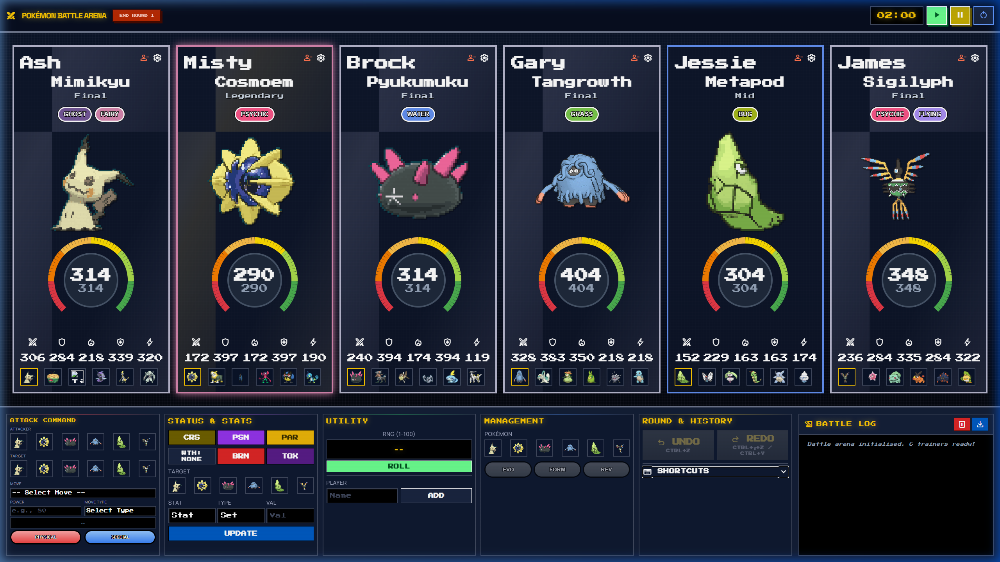

# Pokémon Battle Arena

A high-performance, documentation-first Pokémon battle simulator built with React 19 and Firebase. Featuring real-time 6-player synchronization and immersive "Indigo Plateau" battle mechanics.

## Table of Contents
- [Features](#features)
- [Tech Stack](#tech-stack)
- [Project Structure](#project-structure)
- [Getting Started](#getting-started)
- [Environment Variables](#environment-variables)
- [Documentation](#documentation)
- [Contributing](#contributing)
- [License](#license)

---

## Features
- **Real-time Lobby**: Dynamic room creation and joining with 6-player synchronization.
- **Indigo Plateau Arena**: Premium glassmorphism UI with holographic terminal footers.
- **Battle Engine**: Generation 5 mechanics implementation including 18 unique terrains.
- **Dynamic Terrain System**: 20% power boost for matching move types and primary stats.
- **Premium SFX/Music**: High-fidelity audio integration via Tone.js.



---

## Keyboard Shortcuts

The Arena features a global keyboard shortcut system for fast battle control.

| Action | Shortcut |
|--------|----------|
| **End Round** | `Space` |
| **Physical Attack** | `P` |
| **Special Attack** | `S` |
| **Evolve** | `E` |
| **Form Change** | `F` |
| **Toggle Timer** | `T` |
| **Reset Timer** | `Shift + T` |
| **Undo / Redo** | `Ctrl + Z` / `Ctrl + Y` |

*Note: View the full list or keyboard hints by toggling the "Shortcuts" guide in the Arena sidebar.*

---

## Tech Stack
- **Frontend**: React 19 + Vite 8
- **Styling**: Tailwind CSS 4 (Beta/Vite Plugin)
- **Database**: Firebase Realtime Database (v12.11.0)
- **Audio**: Tone.js (v15.1.22)
- **Icons**: Lucide React (v1.7.0)

See [TECH_STACK.md](./TECH_STACK.md) for the complete dependency list and architectural choices.

---

## Project Structure

```
pokemon-battle-arena/
├── Documentation/        # AI-First knowledge base
│   ├── Project/          # PRD, App Flow, and Roadmap
│   ├── Design_System/    # Tokens, components, and animations
│   ├── Technical/        # DB Schema and API contracts
│   └── Governance/       # Security and audit logs
├── public/               # Static assets (Pokemon data, sound effects)
├── src/
│   ├── components/       # Reusable UI components
│   │   ├── Arena/        # Battle arena specific UI
│   │   ├── Lobby/        # Room management UI
│   │   └── ui/           # Shared design system components
│   ├── context/          # Application state management
│   ├── hooks/            # Custom hooks for Firebase and Battle logic
│   ├── services/         # Firebase and Battle engine services
│   ├── utils/            # Helper functions and constants
│   ├── App.jsx           # Main application entry
│   └── main.jsx          # React DOM mounting
├── firebase.json         # Firebase hosting/rules config
├── package.json          # Dependency management
└── vite.config.js        # Build tool configuration
```

---

## Getting Started

### Prerequisites
- Node.js 20 or higher
- Firebase Project for Realtime Database

### Installation

```bash
# 1. Clone the repository
git clone https://github.com/Sapeksh2001/Pokemon-Battle-Arena.git
cd Pokemon-Battle-Arena

# 2. Install dependencies
npm install

# 3. Copy environment variables
cp .env.example .env
# Edit .env with your Firebase configuration

# 4. Start development server
npm run dev
```

Visit `http://localhost:5173` to view the app.

---

## Environment Variables

| Variable | Required | Description |
|----------|----------|-------------|
| `VITE_FIREBASE_API_KEY` | Yes | Firebase project API key |
| `VITE_FIREBASE_AUTH_DOMAIN` | Yes | Firebase auth domain |
| `VITE_FIREBASE_DATABASE_URL` | Yes | Firebase Realtime Database URL |
| `VITE_FIREBASE_PROJECT_ID` | Yes | Firebase project ID |
| `VITE_FIREBASE_STORAGE_BUCKET` | Yes | Firebase storage bucket |
| `VITE_FIREBASE_MESSAGING_SENDER_ID`| Yes | Firebase sender ID |
| `VITE_FIREBASE_APP_ID` | Yes | Firebase App ID |

---

## Documentation

| Document | Description |
|----------|-------------|
| [PRD.md](./PRD.md) | Product requirements and success metrics |
| [APP_FLOW.md](./APP_FLOW.md) | User flows, navigation map, and screen inventory |
| [TECH_STACK.md](./TECH_STACK.md) | Detailed dependency list and architecture |
| [FRONTEND_GUIDELINES.md](./FRONTEND_GUIDELINES.md) | Design system, tokens, and components |
| [BACKEND_STRUCTURE.md](./BACKEND_STRUCTURE.md) | DB schema and state transition rules |
| [IMPLEMENTATION_PLAN.md](./IMPLEMENTATION_PLAN.md) | Build phases and roadmap |

---

## Contributing

### Branch Naming
- `feature/[name]` — New features
- `fix/[name]` — Bug fixes
- `docs/[name]` — Documentation updates

### Commit Convention
Follow [Conventional Commits](https://www.conventionalcommits.org/):
```
feat: add terrain stat boost calculation
fix: resolve lobby loading bottleneck
docs: update technical guidelines for RTDB
```

---

## License
MIT — see [LICENSE](./LICENSE) for details.
