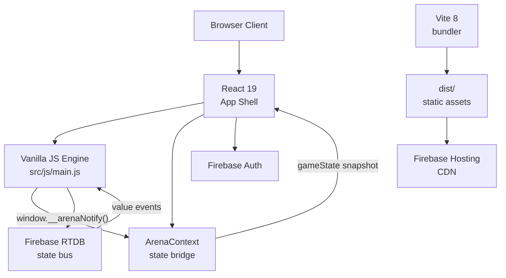
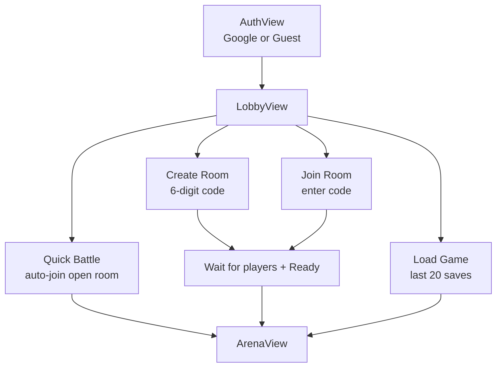
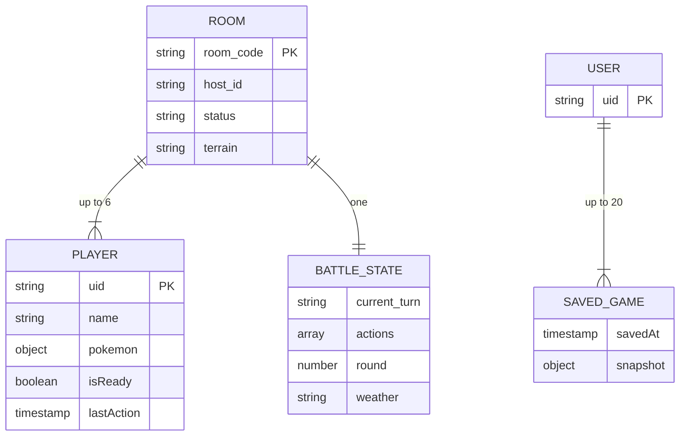
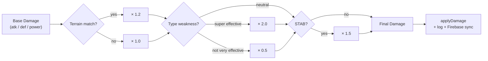
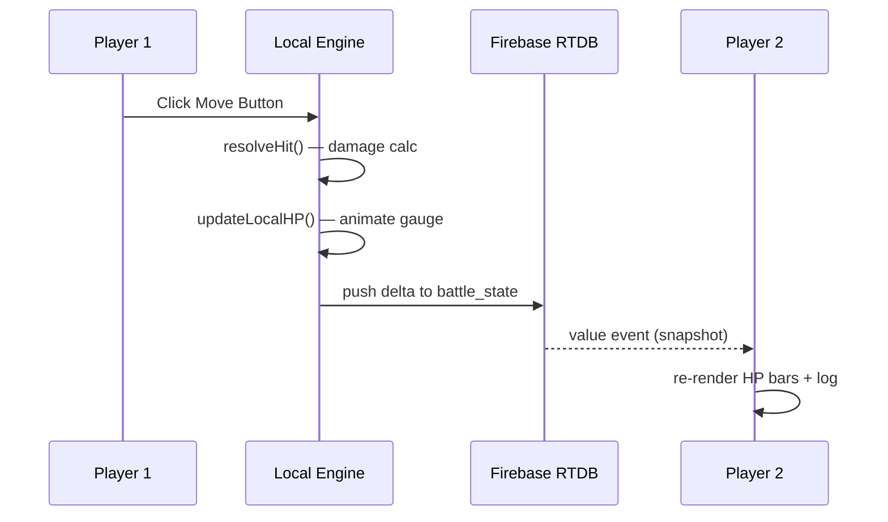

# Pokémon Battle Arena

A browser-based real-time multiplayer Pokémon battle simulator. Up to 6 players, zero install, zero server setup. Built on React 19, Vite 8, Firebase RTDB, and a thick Gen 5 battle engine.

**Live**: [https://pokemon-1248.web.app](https://pokemon-1248.web.app)

---

## Screenshots

### Authentication


### Lobby


### Arena — Battle Screen


### Create Room Modal


---

## Architecture



**Design pattern**: Thick client — all Gen 5 battle math runs locally. Firebase RTDB is the authoritative sync bus only; it holds no business logic.

---

## Features

| Feature | Status |
|---------|--------|
| Google Sign-In + Anonymous guest | ✅ |
| Real-time 6-player multiplayer | ✅ |
| Gen 5 battle engine (Physical / Special / Status) | ✅ |
| 18 Pokémon type effectiveness chart | ✅ |
| STAB + terrain boost multipliers | ✅ |
| Radial HP gauge with color gradient | ✅ |
| Evolve / Devolve / Revive / Form Change | ✅ |
| Dynamic terrain engine (18 terrain types) | ✅ |
| Save / Load game (Firebase + JSON) | ✅ |
| Undo / Redo battle history | ✅ |
| Pixelated holographic card effects (silver/gold) | ✅ |
| Damage number popups | ✅ |
| Tone.js battle music | ✅ |
| Responsive 1–6 column layout | ✅ |

---

## Application Flow



---

## Tech Stack

| Layer | Technology |
|-------|-----------|
| Frontend | React 19, Vite 8 |
| Styling | Tailwind CSS 4, Vanilla CSS |
| Battle Engine | Vanilla JS (src/js/main.js) |
| Real-time sync | Firebase RTDB |
| Auth | Firebase Auth (Google + Anonymous) |
| Hosting | Firebase Hosting |
| Audio | Tone.js |
| Icons | Lucide React + Material Symbols |
| Fonts | Press Start 2P, Space Grotesk, Manrope |

---

## Quick Start

### Prerequisites

- Node.js 20+
- npm 10+
- Firebase CLI: `npm install -g firebase-tools`

### Install + Run

```bash
git clone <repo-url>
cd pokemon-battle-arena-main
npm install
npm run dev
```

Opens at `http://localhost:5173`. Connects to the live Firebase project.

### Build + Deploy

```bash
npm run build
firebase login
firebase use pokemon-1248
firebase deploy --only hosting
```

---

## Project Structure

```
pokemon-battle-arena-main/
├── src/
│   ├── components/           # React components (PokemonPicker, modals, etc.)
│   ├── contexts/             # ArenaContext — engine ↔ React bridge
│   ├── js/
│   │   ├── main.js           # PokemonBattleArena class (battle engine)
│   │   ├── api/
│   │   │   ├── authManager.js    # Firebase Auth wrapper
│   │   │   └── socketClient.js   # RTDB multiplayer: rooms, save/load
│   │   ├── services/         # Damage calc, terrain, undo/redo history
│   │   ├── models/           # Domain models (Player, Pokemon, Move)
│   │   ├── ui/               # DOM renderers (card, HP gauge, log)
│   │   └── utils/            # Type chart, math helpers
│   ├── index.css             # All styles: design tokens, animations, responsive grid
│   ├── firebase.js           # Firebase init
│   ├── movesets.js           # ~1.5MB Gen 5 moveset database
│   ├── pokemon_data.js       # ~575KB base stats
│   ├── moves_data.js         # ~188KB move definitions
│   └── abilities_map.js      # ~127KB ability map
├── PRD.md                    # Product requirements
├── APP_FLOW.md               # Application flow diagrams
├── TECH_STACK.md             # Full tech stack reference
├── FRONTEND_GUIDELINES.md    # CSS tokens, components, animations
├── BACKEND_STRUCTURE.md      # Firebase schema, security rules, logic flow
└── DEPLOYMENT_GUIDE.md       # Build, deploy, CI/CD
```

---

## Firebase Data Structure



---

## Damage Calculation



---

## Multiplayer Sync



---

## Design System

**Fonts**: Press Start 2P (pixel), Space Grotesk (headlines), Manrope (body)

**Palette**:

| Token | Value | Use |
|-------|-------|-----|
| `--color-surface-container` | `#0f1930` | Card backgrounds |
| `--color-primary-container` | `#c4ab01` | Active highlights |
| `--color-secondary-container` | `#005ac2` | Join Room button |
| `--color-tertiary-container` | `#6bff8f` | Quick Battle button |
| `--hp-color-green` | `#4caf50` | HP gauge — healthy |
| `--hp-color-red` | `#e63946` | HP gauge — critical |

**Responsive breakpoints**:

| Viewport | Grid Columns |
|----------|-------------|
| < 480px | 1 |
| 480–1024px | 2 |
| 1024–1400px | 3 |
| 1400–1800px | 4 |
| 1800px+ | 6 |

---

## Documentation

| File | Contents |
|------|----------|
| [PRD.md](PRD.md) | Product goals, user personas, feature list, NFRs |
| [APP_FLOW.md](APP_FLOW.md) | Auth flow, lobby flows, arena sequence, save/load, navigation map |
| [TECH_STACK.md](TECH_STACK.md) | All dependencies, Firebase config, module map |
| [FRONTEND_GUIDELINES.md](FRONTEND_GUIDELINES.md) | Design tokens, component reference, animation system |
| [BACKEND_STRUCTURE.md](BACKEND_STRUCTURE.md) | RTDB schema, security rules, conflict resolution |
| [DEPLOYMENT_GUIDE.md](DEPLOYMENT_GUIDE.md) | Dev setup, build, deploy, CI/CD template |

---

## Known Notes

- `socket.io-client` is in `package.json` but unused — Firebase RTDB is the real-time transport
- Data files (`movesets.js` etc.) total ~3MB bundled — bundle split is a future optimization
- No automated test suite currently configured
- Battle math is client-side authoritative — acceptable for MVP

---

## License

MIT
