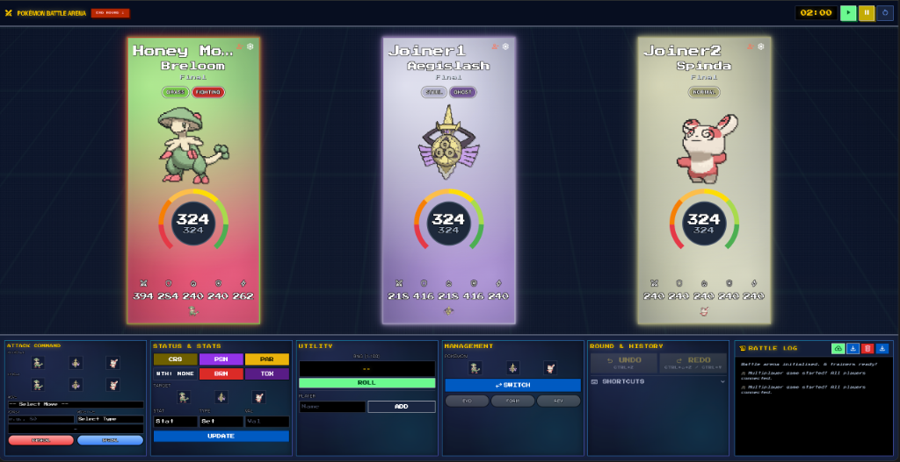
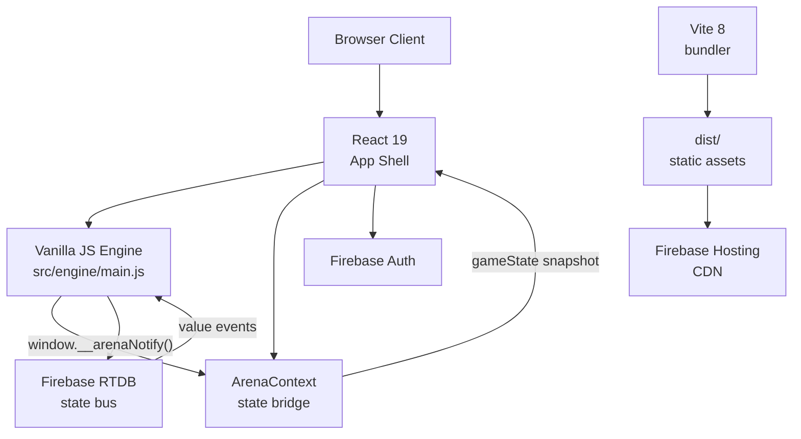
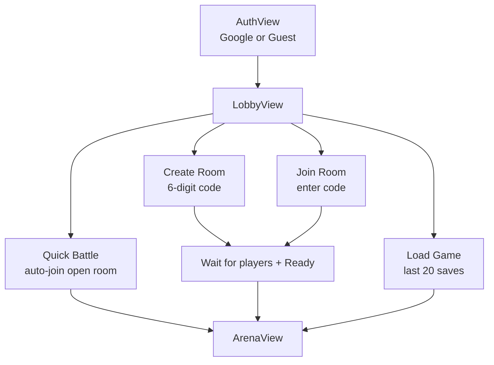
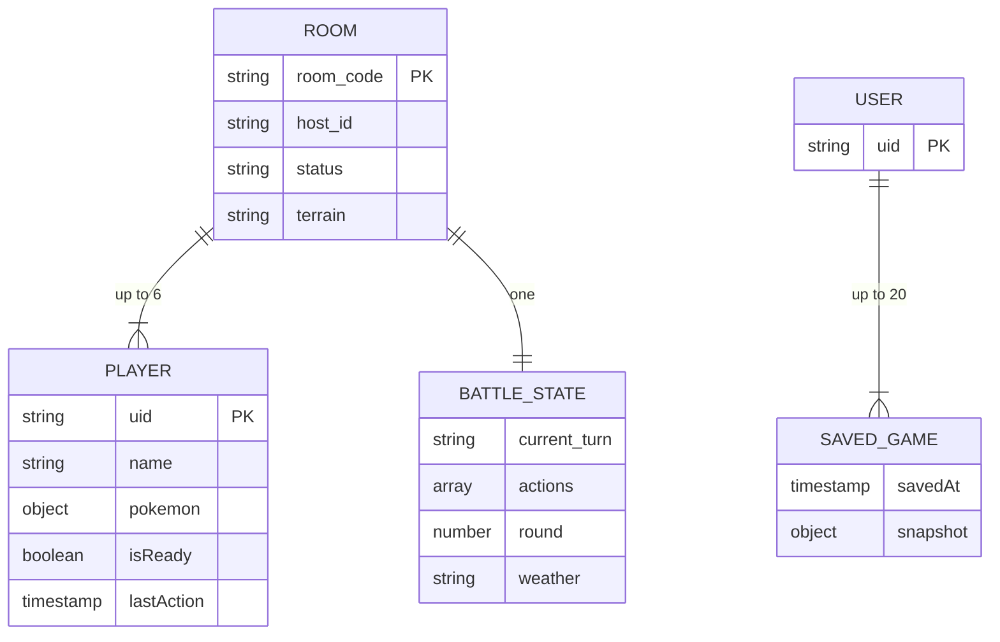
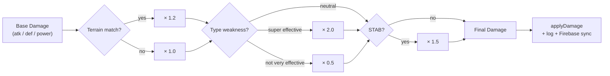
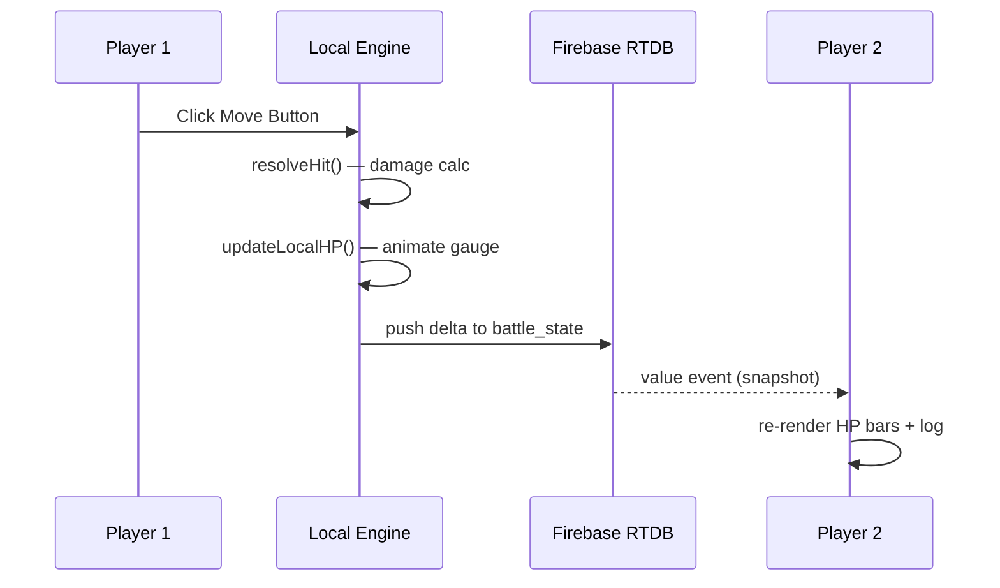

# Pokémon Battle Arena

A browser-based real-time multiplayer Pokémon battle simulator. Up to 6 players, zero install, zero server setup. Built on React 19, Vite 8, Firebase RTDB, and a thick Gen 5 battle engine.

**Live**: [https://pokemon-1248.web.app](https://pokemon-1248.web.app)

---

## Screenshots


### Gameplay


---

## Architecture


```mermaid
flowchart TD
    Browser["Browser Client"] --> React["React 19\nApp Shell"]
    React --> Engine["Vanilla JS Engine\nsrc/engine/main.js"]
    React --> Context["ArenaContext\nstate bridge"]
    Engine -- "window.__arenaNotify()" --> Context
    Context -- "gameState snapshot" --> React

    Engine --> RTDB["Firebase RTDB\nstate bus"]
    React --> Auth["Firebase Auth"]
    RTDB -- "value events" --> Engine

    Vite["Vite 8\nbundler"] --> Bundle["dist/\nstatic assets"]
    Bundle --> Hosting["Firebase Hosting\nCDN"]
```

**Design pattern**: Thick client — all Gen 5 battle math runs locally. Firebase RTDB is the authoritative sync bus only; it holds no business logic.

---

## Features

| Feature | Status |
|---------|--------|
| Google Sign-In + Anonymous guest | ✅ |
| Real-time 6-player multiplayer | ✅ |
| Gen 5 battle engine (Physical / Special / Status) | ✅ |
| 18 Pokémon type effectiveness chart | ✅ |
| STAB + terrain boost multipliers | ✅ |
| Radial HP gauge with color gradient | ✅ |
| Evolve / Devolve / Revive / Form Change | ✅ |
| Trade Pokémon with tier selection | ✅ |
| Shuffle moves on revive + Manual reshuffle | ✅ |
| Dynamic terrain engine (18 terrain types & Def/SpD scaling) | ✅ |
| Active type terrain stat boosts (+15% Attack & Special Attack) | ✅ |
| Save / Load game (Firebase + JSON) | ✅ |
| Undo / Redo battle history | ✅ |
| Pixelated holographic card effects (silver/gold) | ✅ |
| Damage number popups | ✅ |
| Tone.js battle music | ✅ |
| Responsive 1–6 column layout | ✅ |
| Weather engine (9 normal + superior weather types) | ✅ |
| Ability engine (97+ passive abilities resolved) | ✅ |
| Manual Ability/Hidden Ability triggers with tier limits | ✅ |
| Partner Fusion validation (Calyrex, Necrozma, Kyurem, Zygarde, Greninja) | ✅ |
| Status category move processing & auto self-targeting | ✅ |
| Delayed moves (Future Sight, Doom Desire) | ✅ |
| Color-coded stat & move power visual indicators (green/red) | ✅ |
| Strict type immunity secondary effect prevention | ✅ |
| Distortion-free high-quality fullscreen sprite scaling | ✅ |

---

## Application Flow


```mermaid
flowchart TD
    Auth["AuthView\nGoogle or Guest"] --> Lobby["LobbyView"]
    Lobby --> QB["Quick Battle\nauto-join open room"]
    Lobby --> CR["Create Room\n6-digit code"]
    Lobby --> JR["Join Room\nenter code"]
    Lobby --> LG["Load Game\nlast 20 saves"]

    QB --> Arena["ArenaView"]
    CR --> Wait["Wait for players + Ready"] --> Arena
    JR --> Wait
    LG --> Arena
```

---

## Tech Stack

| Layer | Technology |
|-------|-----------|
| Frontend | React 19, Vite 8 |
| Styling | Tailwind CSS 4, Vanilla CSS |
| Battle Engine | Vanilla JS (src/engine/main.js) |
| Real-time sync | Firebase RTDB |
| Auth | Firebase Auth (Google + Anonymous) |
| Hosting | Firebase Hosting |
| Audio | Tone.js |
| Icons | Lucide React + Material Symbols |
| Fonts | Press Start 2P, Space Grotesk, Manrope |

---

## Quick Start

### Prerequisites

- Node.js 20+
- npm 10+
- Firebase CLI: `npm install -g firebase-tools`

### Install + Run

```bash
git clone <repo-url>
cd pokemon-battle-arena-main
npm install
npm run dev
```

Opens at `http://localhost:5173`. Connects to the live Firebase project.

### Build + Deploy

```bash
npm run build
firebase login
firebase use pokemon-1248
firebase deploy --only hosting
```

---

## Project Structure

```
pokemon-battle-arena-main/
├── src/
│   ├── components/           # React components (PokemonPicker, modals, etc.)
│   ├── contexts/             # ArenaContext — engine ↔ React bridge
│   ├── engine/
│   │   ├── main.js           # PokemonBattleArena class (battle engine)
│   │   ├── api/
│   │   │   ├── authManager.js    # Firebase Auth wrapper
│   │   │   └── socketClient.js   # RTDB multiplayer: rooms, save/load
│   │   ├── data/
│   │   │   └── weather.js        # Weather types configuration (9 types)
│   │   ├── services/         # Damage calc, AbilityEngine, terrain, history
│   │   │   ├── AbilityEngine.js  # 97-ability rules engine
│   │   │   └── BattleEngine.js   # Core damage math (weather + ability aware)
│   │   ├── models/           # Domain models (Player, Pokemon, Move)
│   │   ├── ui/               # DOM renderers (card, HP gauge, log)
│   │   └── utils/            # Type chart, math helpers
│   ├── index.css             # All styles: design tokens, animations, responsive grid
│   ├── firebase.js           # Firebase init
│   ├── movesets.js           # ~1.5MB Gen 5 moveset database
│   ├── pokemon_data.js       # ~575KB base stats
│   ├── moves_data.js         # ~188KB move definitions
│   └── abilities_map.js      # ~127KB ability map
└── docs/                     # Documentation files
    ├── PRD.md                # Product requirements
    ├── APP_FLOW.md           # Application flow diagrams
    ├── TECH_STACK.md         # Full tech stack reference
    ├── FRONTEND_GUIDELINES.md# CSS tokens, components, animations
    ├── BACKEND_STRUCTURE.md  # Firebase schema, security rules, logic flow
    └── DEPLOYMENT_GUIDE.md   # Build, deploy, CI/CD
```

---

## Firebase Data Structure


```mermaid
erDiagram
    ROOM {
        string room_code PK
        string host_id
        string status
        string terrain
    }
    PLAYER {
        string uid PK
        string name
        object pokemon
        boolean isReady
        timestamp lastAction
    }
    BATTLE_STATE {
        string current_turn
        array actions
        number round
        string weather
    }
    USER {
        string uid PK
    }
    SAVED_GAME {
        timestamp savedAt
        object snapshot
    }

    ROOM ||--|{ PLAYER : "up to 6"
    ROOM ||--|| BATTLE_STATE : "one"
    USER ||--|{ SAVED_GAME : "up to 20"
```

## Weather & Terrain Systems

The simulator implements a rich dynamic Weather and Terrain engine that modifies move powers, player stats, and applies status protections or end-round damage.

### Weather System (9 Normal & Superior Types)

Superior weather cannot be overridden by standard weather, and the rare **Delta Stream** is untouchable even by other superior weather types.

| Weather | Category | Move Power Modifiers | Tick Damage | Secondary Effects |
|---------|----------|----------------------|-------------|-------------------|
| **None** (Clear) | Neutral | — | — | Default behavior |
| **Sandstorm** | Standard | Sunlight moves halved | 5% HP/round (Immune: Rock, Ground, Steel) | Rock-type Sp. Defense $\times$ 1.5 |
| **Hail** | Standard | Sunlight moves halved | 5% HP/round (Immune: Ice) | Blizzard never misses |
| **Rain** | Standard | Water: 1.5x, Fire: 0.5x | — | Burn status immunity; Thunder & Hurricane never miss |
| **Harsh Sunlight**| Standard | Fire: 1.5x, Water: 0.5x | — | Freeze status immunity; Synthesis/Moonlight heals 66% |
| **Heavy Rain** (Sup)| Superior | Water: 2.0x, Fire/Rock/Ground: 0x | — | Burn status immunity; Electric/Thunder never miss & are super-effective |
| **Extreme Sun** (Sup)| Superior | Fire: 2.0x, Water/Ice/Bug: 0x | — | Freeze status immunity; Fire moves inflict 100% burn |
| **Snow Storm** (Sup) | Superior | Ice: 1.5x, Fire/Grass/Ground/Flying/Rock/Bug/Dragon: 0.5x | 10% HP/round (scaling +5% every 2 turns) | Ice moves become 2x accurate; Water moves converted to Ice |
| **Dune Storm** (Sup) | Superior | Ground: 1.5x, Grass/Bug/Fairy/Electric/Water: 0.5x, Fire/Flying: 0x | 10% HP/round (scaling +10% every turn) | Ground moves become 2x accurate |
| **Delta Stream** (Sup)| Untouchable | Non-Flying: 0.5x | — | Flying-type Speed $\times$ 2.0; blocks weather override |

---

### Terrain System (18 Types)

Except for the neutral **Normal** terrain, each type-themed terrain applies defensive Def/SpD buffs/nerfs (based on weaknesses/resistances) and a stackable **+15% stat boost to Attack and Sp. Attack** for matching Pokémon types. It also provides a **1.2x power boost** to matching move types.

| Terrain | Move Type Boost | Active Type Boost (+15% Atk & SpA) | Dual-Type Def/SpD Modifiers (Weaknesses & Resistances) |
|---------|-----------------|-----------------------------------|-------------------------------------------------------|
| **Normal** | — | — | Neutral (No modifiers) |
| **Fire** | Fire: 1.2x | Fire | **Weak (-10% to -20%):** Bug, Grass, Ice, Steel <br>**Resist (+10% to +20%):** Dragon, Fire, Rock, Water |
| **Water** | Water: 1.2x | Water | **Weak (-10% to -20%):** Fire, Ground, Rock <br>**Resist (+10% to +20%):** Dragon, Grass, Water |
| **Electric**| Electric: 1.2x | Electric | **Weak (-10% to -20%):** Flying, Water <br>**Resist (+10% to +20%):** Dragon, Electric, Grass <br>**Immune (+10%):** Ground |
| **Grassy** | Grass: 1.2x | Grass | **Weak (-10% to -20%):** Ground, Rock, Water <br>**Resist (+10% to +20%):** Bug, Dragon, Fire, Flying, Grass, Poison, Steel |
| **Ice** | Ice: 1.2x | Ice | **Weak (-10% to -20%):** Dragon, Flying, Grass, Ground <br>**Resist (+10% to +20%):** Fire, Ice, Steel, Water |
| **Fighting**| Fighting: 1.2x | Fighting | **Weak (-10% to -20%):** Dark, Ice, Normal, Rock, Steel <br>**Resist (+10% to +20%):** Bug, Fairy, Flying, Poison, Psychic <br>**Immune (+10%):** Ghost |
| **Poison** | Poison: 1.2x | Poison | **Weak (-10% to -20%):** Fairy, Grass <br>**Resist (+10% to +20%):** Ghost, Ground, Poison, Rock <br>**Immune (+10%):** Steel |
| **Ground** | Ground: 1.2x | Ground | **Weak (-10% to -20%):** Electric, Fire, Poison, Rock, Steel <br>**Resist (+10% to +20%):** Bug, Grass <br>**Immune (+10%):** Flying |
| **Flying** | Flying: 1.2x | Flying | **Weak (-10% to -20%):** Bug, Fighting, Grass <br>**Resist (+10% to +20%):** Electric, Rock, Steel |
| **Psychic** | Psychic: 1.2x | Psychic | **Weak (-10% to -20%):** Fighting, Poison <br>**Resist (+10% to +20%):** Psychic, Steel <br>**Immune (+10%):** Dark |
| **Bug** | Bug: 1.2x | Bug | **Weak (-10% to -20%):** Dark, Grass, Psychic <br>**Resist (+10% to +20%):** Fairy, Fighting, Fire, Flying, Ghost, Poison, Steel |
| **Rock** | Rock: 1.2x | Rock | **Weak (-10% to -20%):** Bug, Fire, Flying, Ice <br>**Resist (+10% to +20%):** Fighting, Ground, Steel |
| **Ghost** | Ghost: 1.2x | Ghost | **Weak (-10% to -20%):** Ghost, Psychic <br>**Resist (+10% to +20%):** Dark <br>**Immune (+10%):** Normal |
| **Dragon** | Dragon: 1.2x | Dragon | **Weak (-10% to -20%):** Dragon <br>**Resist (+10% to +20%):** Steel <br>**Immune (+10%):** Fairy |
| **Dark** | Dark: 1.2x | Dark | **Weak (-10% to -20%):** Ghost, Psychic <br>**Resist (+10% to +20%):** Dark, Fairy, Fighting |
| **Steel** | Steel: 1.2x | Steel | **Weak (-10% to -20%):** Fairy, Ice, Rock <br>**Resist (+10% to +20%):** Electric, Fire, Steel, Water |
| **Fairy** | Fairy: 1.2x <br>Dragon: 0.5x | Fairy | **Weak (-10% to -20%):** Dark, Dragon, Fighting <br>**Resist (+10% to +20%):** Fire, Poison, Steel |

---

## Damage Calculation


```mermaid
flowchart LR
    Base["Base Damage\n(atk / def / power)"] --> T1{"Terrain match?"}
    T1 -- yes --> x12["× 1.2"]
    T1 -- no --> Skip["× 1.0"]
    x12 --> T2{"Type weakness?"}
    Skip --> T2
    T2 -- "super effective" --> x20["× 2.0"]
    T2 -- "not very effective" --> x05["× 0.5"]
    T2 -- neutral --> T3{"STAB?"}
    x20 --> T3
    x05 --> T3
    T3 -- yes --> x15["× 1.5"]
    T3 -- no --> Final["Final Damage"]
    x15 --> Final
    Final --> Apply["applyDamage\n+ log + Firebase sync"]
```

---

## Multiplayer Sync


```mermaid
sequenceDiagram
    participant P1 as Player 1
    participant Eng as Local Engine
    participant FB as Firebase RTDB
    participant P2 as Player 2

    P1->>Eng: Click Move Button
    Eng->>Eng: resolveHit() — damage calc
    Eng->>Eng: updateLocalHP() — animate gauge
    Eng->>FB: push delta to battle_state
    FB-->>P2: value event (snapshot)
    P2->>P2: re-render HP bars + log
```

---

## Design System

**Fonts**: Press Start 2P (pixel), Space Grotesk (headlines), Manrope (body)

**Palette**:

| Token | Value | Use |
|-------|-------|-----|
| `--color-surface-container` | `#0f1930` | Card backgrounds |
| `--color-primary-container` | `#c4ab01` | Active highlights |
| `--color-secondary-container` | `#005ac2` | Join Room button |
| `--color-tertiary-container` | `#6bff8f` | Quick Battle button |
| `--hp-color-green` | `#4caf50` | HP gauge — healthy |
| `--hp-color-red` | `#e63946` | HP gauge — critical |

**Responsive breakpoints**:

| Viewport | Grid Columns |
|----------|-------------|
| < 480px | 1 |
| 480–1024px | 2 |
| 1024–1400px | 3 |
| 1400–1800px | 4 |
| 1800px+ | 6 |

---

## Documentation

| File | Contents |
|------|----------|
| [PRD.md](docs/PRD.md) | Product goals, user personas, feature list, NFRs |
| [APP_FLOW.md](docs/APP_FLOW.md) | Auth flow, lobby flows, arena sequence, save/load, navigation map |
| [TECH_STACK.md](docs/TECH_STACK.md) | All dependencies, Firebase config, module map |
| [FRONTEND_GUIDELINES.md](docs/FRONTEND_GUIDELINES.md) | Design tokens, component reference, animation system |
| [BACKEND_STRUCTURE.md](docs/BACKEND_STRUCTURE.md) | RTDB schema, security rules, conflict resolution |
| [DEPLOYMENT_GUIDE.md](docs/DEPLOYMENT_GUIDE.md) | Dev setup, build, deploy, CI/CD template |

---

## Known Notes

- `socket.io-client` is in `package.json` but unused — Firebase RTDB is the real-time transport
- Data files (`movesets.js` etc.) total ~3MB bundled — bundle split is a future optimization
- No automated test suite currently configured
- Battle math is client-side authoritative — acceptable for MVP

---

## License

MIT
