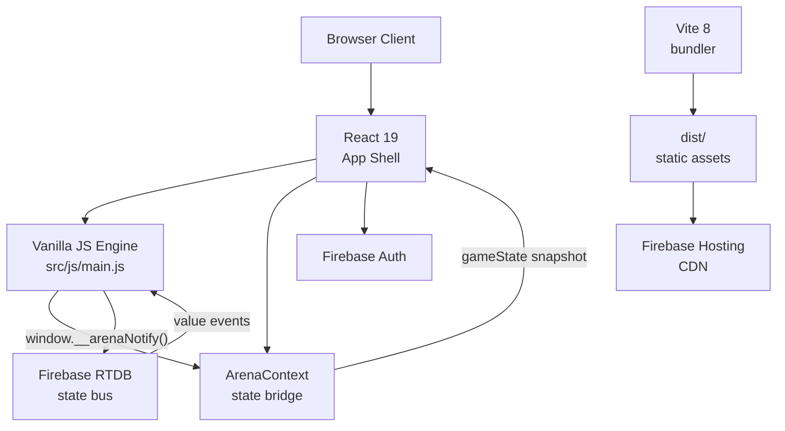
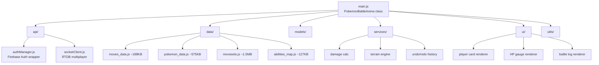

# Technology Stack — Pokémon Battle Arena

**Last Updated**: 2026-04-13
**Version**: 1.2.0

---

## 1. Architecture



| Layer | Pattern |
|-------|---------|
|-------|---------|
| Overall | Serverless real-time web app |
| Client | Thick client — runs all battle logic locally |
| Sync | Firebase RTDB as authoritative state bus |
| Bundle | Vite ESM build; single HTML entry point |
| Deploy | Firebase Hosting (CDN) |

The legacy engine (`src/js/main.js`) is a vanilla JS class hierarchy that was wrapped in React during the migration. React components are structural shells; the engine mutates DOM and fires `window.__arenaNotify()` to sync state into React via `ArenaContext`.

---

## 2. Frontend

### Framework
- **React 19** (`^19.2.4`) — app shell, auth gate, context bridge
- Strategy: "legacy-wrap". All views are always in the DOM; the engine toggles `.hidden` classes. React re-renders from `window.arena.gs` snapshots only.

### Build Tool
- **Vite 8** (`^8.0.1`) — ESM, sub-second HMR
- Config: `@vitejs/plugin-react` (`^6.0.1`)

### Styling
- **Tailwind CSS 4** (`^4.2.2`) with `@tailwindcss/vite` plugin
- Design tokens defined in `@theme {}` block at top of `src/index.css`
- Global custom CSS lives in `src/index.css` (920 lines) — handles arena cards, HP gauge, animations, responsive grid, modal overlays, and Tailwind utility extensions
- No CSS Modules; no Styled-Components

### Fonts (Google Fonts CDN)
| Font | Role |
|------|------|
| Press Start 2P | Global body, labels, terminal — CRT/pixel aesthetic |
| Space Grotesk | Headlines (`font-headline`) |
| Manrope | Body copy (`font-body`) |
| Material Symbols Outlined | Icon set (variable font) |

### Animation
- Pure CSS keyframes for all sprite effects (damage shake, heal glow, evolve flash, faint)
- CSS `transition` for HP gauge needle and card highlight states
- No animation library (Framer Motion listed in older docs but **not in package.json**)

### Audio
- **Tone.js** (`^15.1.22`) — Web Audio API wrapper for battle music and SFX transitions

---

## 3. Backend & Sync

### Firebase SDK
- **firebase** `^12.11.0` — modular SDK
- Modules used: `firebase/auth`, `firebase/database`, `firebase/analytics`
- Initialized in `src/firebase.js`; exported as `auth`, `db`, `analytics`

### Firebase Auth
- Providers: Google Sign-In, Anonymous
- `authManager` service (`src/js/api/authManager.js`) wraps `onAuthStateChanged` and exposes a pub/sub `subscribe()` interface
- Display name stored as Firebase Auth `displayName`; LobbyView syncs updates

### Firebase RTDB
- Project: `pokemon-1248`
- Database URL: `https://pokemon-1248-default-rtdb.firebaseio.com`
- Data tree: `/rooms/{room_id}/…`; `/users/{uid}/saved_games/{room_code}/…`
- Data model described in BACKEND_STRUCTURE.md

### Firebase Hosting
- `firebase.json` points to `dist/` as public directory
- SPA rewrite: all routes → `index.html`
- Cache headers on assets: 1 year for hashed files

### Firebase Analytics
- `measurementId: G-G07TP1ENV6`
- Used for room creation and session metrics

---

## 4. Key Data Files

All data files are large static JS modules bundled at build time:

| File | Size | Purpose |
|------|------|---------|
| `src/movesets.js` | ~1.5MB | Full Gen 5 moveset database |
| `src/pokemon_data.js` | ~575KB | Base stats and metadata |
| `src/moves_data.js` | ~188KB | Move definitions (power, accuracy, type, category) |
| `src/Pokemon_NewDataset.js` | ~786KB | Extended Pokémon dataset |
| `src/abilities_map.js` | ~127KB | Ability → effect map |
| `src/ability.js` | ~44KB | Ability resolution logic |

> These files are the primary bundle-size concern. First-load progress is surfaced via `window.__loadProgress` polled by `ArenaContext`.

---

## 5. Engine Module Map



```
src/js/
├── main.js              # PokemonBattleArena class — bootstraps all services
├── api/
│   ├── authManager.js   # Firebase Auth wrapper with subscribe pattern
│   └── socketClient.js  # RTDB multiplayer: room create/join/sync, save/load
├── data/                # Data loaders / lookups
├── models/              # Domain models (Player, Pokemon, Move, etc.)
├── services/            # Battle engine services (damage calc, terrain, history)
├── ui/                  # DOM renderers (player card, HP gauge, log)
└── utils/               # Helpers (type chart, math, formatters)
```

---

## 6. Runtime Dependencies (package.json)

```json
{
  "dependencies": {
    "@tailwindcss/vite": "^4.2.2",
    "firebase": "^12.11.0",
    "lucide-react": "^1.7.0",
    "react": "^19.2.4",
    "react-dom": "^19.2.4",
    "socket.io-client": "^4.8.3",
    "tone": "^15.1.22"
  },
  "devDependencies": {
    "@eslint/js": "^9.39.4",
    "@types/react": "^19.2.14",
    "@types/react-dom": "^19.2.3",
    "@vitejs/plugin-react": "^6.0.1",
    "autoprefixer": "^10.4.27",
    "eslint": "^9.39.4",
    "eslint-plugin-react-hooks": "^7.0.1",
    "eslint-plugin-react-refresh": "^0.5.2",
    "globals": "^17.4.0",
    "postcss": "^8.5.8",
    "tailwindcss": "^4.2.2",
    "vite": "^8.0.1"
  }
}
```

> **Note**: `socket.io-client` is present as a dependency but Firebase RTDB is the active real-time transport. `socket.io-client` is unused in current code.

---

## 7. Security

### Firebase Rules (RTDB)
```json
{
  "rules": {
    "rooms": {
      "$room_id": {
        ".read": "true",
        ".write": "!data.exists() || data.child('host_id').val() === auth.uid",
        "players": {
          "$uid": {
            ".write": "$uid === auth.uid"
          }
        },
        "battle_state": {
          ".write": "data.parent().child('status').val() === 'active'"
        }
      }
    },
    "users": {
      "$uid": {
        ".read": "$uid === auth.uid",
        ".write": "$uid === auth.uid"
      }
    }
  }
}
```

### Rate Limiting
- 200ms write debounce per player (engine-enforced, not DB rule-enforced)
- Max 6 players per room (engine-enforced at join time)
- Battle state payload capped at < 64KB target

---

## 8. CI / CD

| Stage | Tool |
|-------|------|
| Lint | ESLint 9 (`npm run lint`) |
| Build | `vite build` → `dist/` |
| Deploy | `firebase deploy --only hosting` |
| Environments | `development` (Vite dev server), `production` (Firebase Hosting) |

No automated test suite is currently configured.

---

## 9. Browser / Device Support

| Platform | Minimum |
|----------|---------|
| Chrome | 120+ |
| Firefox | 115+ |
| Safari (macOS) | 17+ |
| Safari (iOS) | 17+ |
| Chrome (Android) | 114+ |
| Screen width | 320px to 4K |
